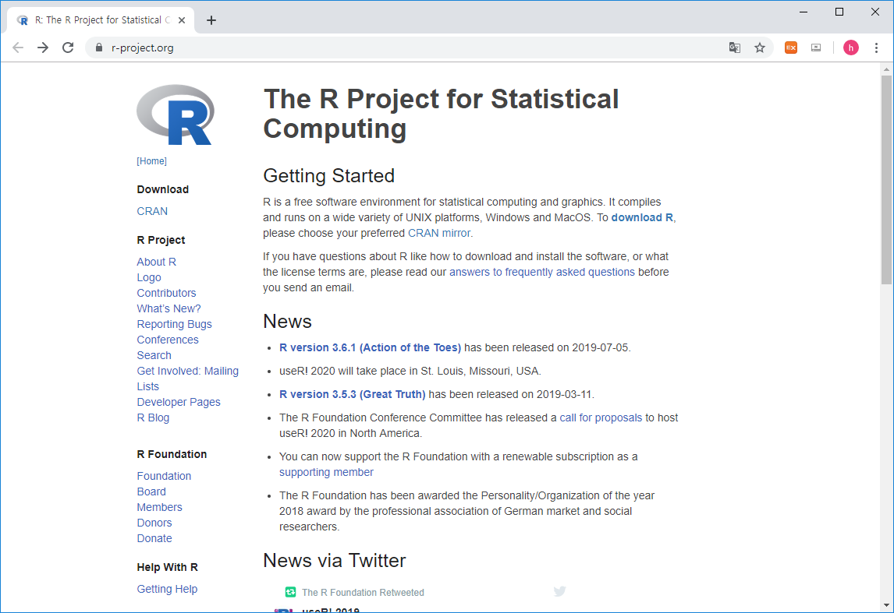

# R basics  

## What is R / Rstudio 

<center>

</center>

- R is a programming language that runs computations (https://www.r-project.org/)
- RStudio is an integrated development environment (IDE) that provides an interface for the programming (https://www.rstudio.com/)


## R / Rstudio installation

- Install R first and then install RStudio second
- R 
  
  
  
  
  
 
- Rstudio
  
  
  
  
  


## Rstudio interface


## Keyboard shortcuts

- 참고사이트 
  - https://support.rstudio.com/hc/en-us/articles/200711853-Keyboard-Shortcuts
  - Tools --> Keyboard shortcut Quick Reference (Alt + Shift + K)
- 코드편집창 이동 (Ctrl+1) 콘솔창 이동(Ctrl+2)
- 한 줄 실행 (Ctrl+Enter)
- 주석처리 (Ctrl + Shift + C) 
  - Starting with a hashmark (‘#’), everything to the end of the line is a comment

- 실습

  - 코드편집창에서 다음 입력 
  -   
  - 단축키 Ctrl + enter로 코드 실행 
  - 단축키 Ctrl + 2로 커서 콘솔창으로 이동
  - x값 x+y값 확인 
  - 단축키 Ctrl + 1로 코드편집창 이동 
  - 단축키 Ctrl + Shift + C 사용

```{r, eval=F}
# x <- 10
# y <- 20

```


## R programming basics and terminology

- Console: 명령어 입력하는 창 
- Code: R 프로그래밍 변수/제어문 모음   
- Objects (개체, variable): 값이 (데이터) 저장되는 장소 
- Data types: Integers, doubles/numerics, logicals, and characters.
- Object (Variable) types:
  - Vectors: 값들의 모임 combine function c() EX: c(6, 11, 13, 31, 90, 92)
  - Factors: 범주형 데이터 저장 장소
  - Data frames: 2D matrix 형태 데이터 자장 장소 
- Conditionals (조건, 제어):
  - if: ==, & (AND), | (OR) Ex: (2 + 1 == 3) & (2 + 1 == 4) 
  - for, while: 반복 수
- Functions (함수, commands): 특정 일 수행, 함수이름 - 입력값 (arguments) - 출력값 (output) 으로 구성 

## Set working directory  

- 시작 전 항상 작업 디렉토리 설정 
- 예를 들어 c:\ 아래 새로운 디렉토리 rstat01 을 만들고 작업공간으로 설정  

```{r, eval=FALSE}
getwd()
dir()
setwd("C:\\rstat01")
getwd()
dir()
```

- 또는 아래와 같이 RStudio 메뉴 에서 설정 
  


## R coding practice 

- 콘솔 계산기 
```{r, eval=FALSE}
2 + 2
((2 – 1)^2 + (1 – 3)^2 )^(1/2)
2 + 2; 2 - 2
```
- 이전 명령: 콘솔에서 위 아래 화살표  


## Variables and values 

- R is a programming language 
- Assignment operator ( `<-` OR `=` )
  - Valid object name `<-` value 
  - 단축키: `Alt + -` (the minus sign)
- 내장 변수 Built-in variables

```{r, eval=FALSE}
x <- 2
y <- x^2 – 2*x + 1
y
x <- "two"  
some_data <- 9.8
pi
```

- 변수이름 작명법 
  - Characters (letters), numbers,  “_”,  “.”
  - A and a are different symbols
  - Names are effectively unlimited in length

```{r, eval=F}
i_use_snake_case <- 1
otherPeopleUseCamelCase <- 2
some.people.use.periods <- 3
And_aFew.People_RENOUNCEconvention <- 4
```

- 자동 완성 기능 (Tab completion) in RStudio


## Variable type of (storage) mode


## Variable - Vectors 

- Combine function `c()`: Concatenating elements end to end

```{r, eval=FALSE}
x <- c(10.4, 5.6, 3.1, 6.4, 21.7) 
y <- c("X1", "Y2",  "X3",  "Y4")
```

- 인덱싱: Subsets of the elements of a vector 

```{r, eval=F}
x[1]
x[1:3]
x[c(1,2,4)]
y[3]
```


## Functions

- Function define

```{r, eval=FALSE}
my_sine <- function(x){
	y <- sin(x)
	return(y)
}
```

- Usage

```{r, eval=F}
my_sine(pi)
```

- Terminology 
  - function name: `my_sine`
  - parameter: `x`
  - argument: `pi`
  - return value: `y`


- Built-in functions
  - Arguments separated by commas
  - Tab completion


```{r, eval=F}
x <- pi
sin(x)
sqrt(x)
log(x)
log(x, 10)
x <- c(10, 20, 30)
x + x
mean(x)
sum(x)/length(x)
```


## Vectorized functions

```{r, eval=F}
x <- c(10, 20, 30)
x + x
sqrt(x)
sin(x)
log(x)
x-mean(x)
```


## Help

- R의 장점 중 하나 (예제 포함)

```{r, eval=F}
?
?mean
help("mean")
example("mean")
help.search("mean")
help(package="MASS")
```


## RStudio workspace


## R packages

- R comes ready loaded with various libraries of functions called packages
 + ex) sum() is in the “base” package and sd() in the “stats” package
- The packages can be found in numerous server locations on the web called repositories
 + The Comprehensive R Archive Network (CRAN) http://cran.r-project.org/web/views/
 + Bioconductor specialised in genomics http://www.bioconductor.org/packages/release/bioc/
 


- UsingR package installation


- UsingR package loading

```{r, eval=F}
library(UsingR)
```

- R 설치 디렉토리
- R 패키지 설치 디렉토리

```{r, eval=F}
.libPaths()
path.package()
```


## Data sets

- Packages include accompanying data sets
- R has a datasets package that is loaded automatically
- The data function  produces a copy of dataset in user’s workspace

```{r, eval=F}
head(rivers)
length(rivers)
class(rivers)
data(rivers)
data(package="UsingR")
library(HistData)
head(Cavendish)
str(Cavendish)
head(Cavendish$density2)
```


## Cheatsheet


