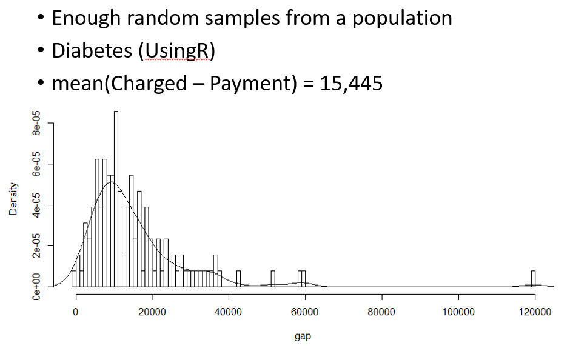

# Statistical inference

## Introduction

통계적 추정이란 모집단으로부터 임의 추출된 표본을 이용하여 모집단을 추정하는 과정을 의미합니다. 앞에서 배운 내용이지만 다음 네 가지 중요한 키워드들이 있습니다. 

* 모집단 (population)
* 모수 (Parameter) - 모집단의 분포를 설명하는 특정 값
* 표본 (sample) - 모집단으로부터 임의 추출된 관측값의 모음
* 통계량 (statistics) - 표본의 평균, 분산과 같은 대표값

다음은 표준정규분포 모집단에서 (모수: $\mu, \sigma$) 16개 표본을 임의 추출하여 평균을 (통계량) $\bar{x}$ 구하고 이 과정을 10번 반복한 상황을 표현한 그림으로 통계적 추론의 과정을 보여 줍니다. 


[UsingR for introductory statistics, 243 페이지]

* 어떤 임의 표본에 대해서 $\bar{x}$의 표본분포는 $\mu$ 근처에 위치
* 어떤 임의 표본에 대해서 $\bar{x}$의 표본분포의 표준편차는 $\sigma/\sqrt{n}$ 로 표현 ($\sigma$는 모분산, 표본들의 분산보다 작음)
* 모분포가 정규분포이면 $\bar{x}$도 정규분포 (반복이 많아질수록, 중심극한정리)
* 시뮬레이션으로 이론 확인 


## Simulation


**[EXERCISE]** N(0, 1)의 분포를 dnorm을 이용해 그리시오 (xlim=c(-4,4))

```{r, eval=T, echo=F}
library(ggplot2, quietly = T)

x <- seq(-4, 4, by=0.01)
y <- dnorm(x, 0, 1)
dat <- data.frame(x, y)
ggplot(dat, aes(x, y)) +
  geom_line()

```


**[EXERCISE]** 표준정규분포로부터 16개의 표본을 뽑아 평균을 구하고 각 표본과 평균 값들을 y=1 위치에 점으로 표현하시오 (rnorm사용)

```{r, eval=T, echo=F}
library(ggplot2, quietly = T)

nsample <- 16
x <- rnorm(nsample, 0, 1)
y <- rep(1, nsample)
xbar <- mean(x)
dat <- data.frame(x, y)
ggplot(dat, aes(x, y)) +
  geom_point() +
  geom_point(aes(x=mean(x), y=1), colour="blue", size=5, shape=15)

```


**[EXERCISE]** 위 예제를 두 번 반복하되 두 번째 데이터는 y=0.9 위치에 표현하시오

```{r, eval=T, echo=T}
library(ggplot2, quietly = T)

nsample <- 16
x <- rnorm(nsample*2, 0, 1)
y <- c(rep(1, nsample), rep(0.9, nsample))
g <- factor(c(rep(1, nsample), rep(2, nsample)))

dat <- data.frame(x, y, g)

ggplot(dat, aes(x, y)) +
  geom_point() +
  geom_point(aes(x=mean(x[1:nsample]), y=1), colour="blue", size=5, shape=15) +
  geom_point(aes(x=mean(x[(nsample+1):length(x)]), y=0.9), colour="blue", size=5, shape=15) +
  scale_y_continuous(limits=c(0, 1.2))

```


**[EXERCISE]** 위 예제를 10번 반복하되 각 반복 데이터는 각각 y=1, 0.9, 0.8, ..., 0.1 위치에 표현하시오

```{r, eval=T, echo=T}
suppressWarnings(suppressMessages(library(ggplot2, quietly = T)))
suppressWarnings(suppressMessages(library(dplyr, quietly = T)))

nsample <- 16
nrep <- 10

x <- rnorm(nsample*nrep, 0, 1)
tmpy <- seq(0.1, 1, length.out=nrep)
y <- rep(tmpy, each=nsample)
## ?rep
g <- factor(y)

dat <- data.frame(x, y, g)
dat_mean <- dat %>% 
  group_by(g) %>% 
  summarise(mean=mean(x))

ggplot(dat, aes(x, y)) +
  geom_point() +
  scale_y_continuous(limits=c(0, 1.1)) +
  geom_point(data=dat_mean, aes(y=as.numeric(as.character(g)), x=mean), colour="blue", size=5, shape=15)

str(dat_mean)
as.numeric(as.character(dat_mean$g))


ggplot() + 
  geom_point(data=dat, aes(x, y)) +
  geom_point(data=dat_mean, aes(x=mean, y=as.numeric(as.character(dat_mean$g))), colour="blue", size=5, shape=15) +
  theme_bw()
  
  

```

**[EXERCISE]** 위 예제와 함께 표준정규분포 곡선과 $\bar{x}$의 분포를 모두 같이 그리시오 


## Significance tests

두 그룹의 데이터 (표본)을 가지고 있을 때 두 그룹이 통계적으로 차이가 있는지를 검증하는 방법으로 (코흐트 데이터, Case-control 데이터) 시뮬레이션에 의한 방법을 먼저 소개하고 이 후 분포를 기준으로 통계적 검증을 알아보겠습니다. 

카페인(커피)이 초초한 상태를 유발하는가? 라는 질문에 답하기 위해서 보통 두 그룹의 평균의 차이를 비교합니다. 

```{r, eval=T}
coff <- c(245, 246, 246, 248, 248, 248, 250, 250, 250, 252)
nocoff <- c(242, 242, 242, 244, 244, 245, 246, 247, 248, 248)
dat <- data.frame(coff, nocoff)
obs <- with(dat, mean(coff) - mean(nocoff))
obs
```

Randomization distribution 상태로 데이터를 다시 두 그룹으로 나누어 차이를 계산하고 이 과정을 반복해서 분포를 그려보겠습니다. 

**[EXERCISE]** 두 그룹 데이터에서 임으로 10명을 두 번 뽑아 그 평균의 차이를 계산하시오 

```{r, eval=T, echo=F}

caf <- c(245, 246, 246, 248, 248, 248, 250, 250, 250, 252)
no_caf <- c(242, 242, 242, 244, 244, 245, 246, 247, 248, 248)
random_data <- c(caf, no_caf) 
obs <- mean(caf) - mean(no_caf)

x <- sample(random_data, 10, replace=T)
y <- sample(random_data, 10, replace=T)

mean(x) - mean(y)
```


**[EXERCISE]** 위 예제의 과정을 1000번 반복하고 각 차이값의 분포를 그리시오 

```{r, eval=T, echo=F}
suppressWarnings(suppressMessages(library(ggplot2, quietly = T)))
suppressWarnings(suppressMessages(library(dplyr, quietly = T)))

caf <- c(245, 246, 246, 248, 248, 248, 250, 250, 250, 252)
no_caf <- c(242, 242, 242, 244, 244, 245, 246, 247, 248, 248)
random_data <- c(caf, no_caf) 

z <- rep(0, 1000)
for(i in 1:1000){
  x <- sample(random_data, 10, replace=T)
  y <- sample(random_data, 10, replace=T)
  z[i] <- mean(x) - mean(y)
}
hist(z, br=100, xlim=c(-4,4))
dat <- data.frame(z, y, x)
ggplot(dat, aes(x=z)) + geom_histogram()

#obs <- mean(caf)-mean(no_caf)
#res <- replicate(2000, {
#  ind <- sample(1:20, 10, replace=F)
#  mean(the_data$values[ind]) - mean(the_data$values[-ind])
#})
#hist(res, br=100)
#abline(v=obs, col="red", lty=2)


```


**[EXERCISE]** 분포에서 실제 관측한 3.5 값의 위치를 표시하고 관측값보다 더 극단적인 경우가 나올 경우의 비율을 계산하시오 

```{r, eval=T, echo=F}

empval <- sum(dat$z > obs)/length(dat$z)

ggplot(dat, aes(x=z)) + 
  geom_histogram() +
  geom_vline(xintercept = obs, color="white", linetype = "dashed") +
  geom_segment(aes(x = obs+0.2, y = 30, xend = obs+0.2, yend = 5), 
               arrow = arrow(), 
               size=2) +
  annotate("text", label = empval, x = obs+0.2, y = 35, size = 5)


```


## Estimation and confidence interval 

앞서 예제에서 두 그룹간 평균의 차이가 통계량 (statistic) 입니다. 통계량은 모수 (parameter)를 추정하기 위한 값으로 볼 수 있고 이 값이 얼마나 모수와 가까운지, 즉 차이가 0에 가까운지 판단하는 것은 통계적 추정에서 가장 중요한 부분 중 하나 입니다. 일반적으로 $\mu, \sigma$ 등 모수는 $\theta$로 표현하고 $\theta$를 추정하기위한 통계량은 $\hat{\theta}$로 표현합니다. 다음 식으로 우리가 계산한 통계량이 얼마나 모수에 가까운지는 다음 식으로 알 수 있습니다. 

$$
E((\hat{\theta} - \theta)^2) = VAR(\hat{\theta}) + (E(\hat{\theta}-\theta))^2 = \text{variance} + \text{bias}^2
$$
우리가 언급하는 통계량들은 대부분 unbiased 입니다. 불편추정량 (unbiased estimator)이라 부르며 다음과 같은 것들이 있습니다. 

* $E(\bar{x}) = \mu$
* $E(\bar{p}) = p$
* $E(s^2) = \sigma^2$

예를 들어 A poll asking a random sample of 1003 whether marriages between same-sex couples should be recognized by law as valid. 55% said yes, 이 경우 A randomly selected person would responding yes with p  = 0.55 입니다. 

여기서 이러한 투표를 100번 반복 했을 때 계산되는 찬성 비율 값들이 대부분 (또는 95%는) 어디에 모여 있는가? 라는 질문을 할 수 있고 이는 모집단에서의 찬성 비율 (모수, 진짜) 값의 95% 신뢰구간은 무엇인가? 라는 질문과 같습니다. 이를 위해 다음 시뮬레이션을 수행할 수 있습니다. 

```{r, eval=T, echo=T}

p <- 0.55
n <- 1003
x <- rbinom(1000, n, p)
#mean(x)
hist(x, br=100)
quantile(x, c(0.025, 0.975))

```

앞 뒤 0.025%를 제외한 구간은 위와 같으며 위 구간이  95% 신뢰구간이 됩니다. 뒤에서 설명이 나오지만 여기서 신뢰구간의 해석을 한 번 생각해 보면 좋습니다. 

그런데 현실에서는 1000번의 반복이 불가능하며 1번 또는 2번의 데이터로 95% 신뢰구간을 구해야 합니다. 

```{r, eval=T, echo=T}
x <- rbinom(2, n, p)
## mean(x)
hist(x, br=100)

```

여기서 다시 기억할 부분은 앞에서 배운 확률변수 표본평균의 표본 분포는 정규분포이며 그 표준편차는 모표준편차를 $\sqrt{n}$으로 나누어준 값이라는 것 입니다. 후에 좀 더 학습할 예정이며 지금은 시뮬레이션으로 얼마든지 반복해서 샘플링이 가능한 것으로 생각하겠습니다. 위 분포의 형태는 대략적으로 정규분포 입니다. z-통계량은 다음과 같이 나타낼 수 있고 t-통계량은 $\sigma$ 대신 $s$를 사용한 경우를 말합니다.  


$$
\begin{split}
\bar{x} &= \mu \to \bar{x} - \mu =0 \\

z &= \frac{\bar{x} - \mu}{\sigma / \sqrt{n}} \sim N(0,1) \\

t &= \frac{\bar{x} - \mu}{s/\sqrt{n}} \sim T
\end{split}
$$

평균 100, 표준편차 16인 모분포에서 4개의 샘플을 랜덤하게 추출하여 그 평균을 구할 경우 그 값은 정규분포를 따르고 표준화 값인 z값은 정규분포 N(0, 1)을 따릅니다. 현실에서는 불가능하지만 다음과 같은 시뮬레이션으로 확인할 수 있습니다. 

```{r, eval=T, echo=T}

mu <- 100
sigma <- 16
M <- 1000
n <- 4
res <- replicate(M, {
	x <- rnorm(n, mu, sigma)
	se <- sd(x)/sqrt(n)
	(mean(x) - mu)/se
})

quantile(res, c(0.025, 0.975))
hist(res, br=100)
```


```{r, eval=T, echo=F}

ggplot(data.frame(res), aes(x=res)) + 
  geom_histogram()

```

참고로 다음은 오차 (error), 편차/잔차 (deviance/residual), 그리고 편향 (bias) 에대한 개념을 나타냅니다. 


이제 앞서 예제에서 95% 신뢰구간을 구해봅니다. 이는 앞서 언급한바와 같이 데이터의 95% 가 어디 있는가에 대한 질문과 같으며 이는 위와 같은 대칭형 분포에서 왼쪽 0.025% 와 오른쪽 0.025%를 제외한 가운데 부분의 데이터를 말합니다. 즉 아래 식처럼 T 값이 ```quantile(res, 0.025)=-3.33``` 와 ```quantile(res, 0.975)=3.07``` 값 사이에 있음을 의미합니다. 

$$
\begin{split}
-3.33 <  \frac{\bar{x} - \mu}{s/\sqrt{n}} &< 3.07 \\
\bar{x} -3.33 \times s/\sqrt{n}  < \mu &< \bar{x} + 3.07 \times s/\sqrt{n}  \\
-0.027 - 3.33 \times 1.56/\sqrt{1000} 
\end{split}
$$

이를 다시 나타내면 


## Bootstrap 




```{r, eval=F}
obs <- mean(Medicare$Average.Covered.Charges-Medicare$Average.Total.Payments)

dat <- c(Medicare$Average.Covered.Charges, Medicare$Average.Total.Payments)
n <- 1000
dif <- rep(0, n)
dif

for(i in 1:n){
  dif[i] <- mean(sample(dat, 10000, T) - sample(dat, 10000, T))
}
dif
hist(dif)
dat_df <- data.frame(dif)
head(dat_df)
ggplot(dat_df, aes(x=dif)) +
  geom_histogram() +
  annotate("text", label=obs, x=1000, y=75, obs)

sum(dif > obs)
hist(dif)


```


