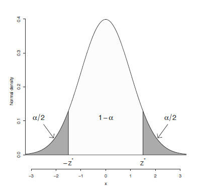

# Confidence intervals

## CI for population proportion, $p$

시뮬레이션이 아닌 분포 가정에 기반한 모비율 $p$에 대한 신뢰구간을 구하는 방법입니다. 

$$
\frac{\hat{p}-p}{SE(\hat{p})} = \frac{observed - expected}{SE} \\
SE(\hat{p}) = \sqrt{\frac{\hat{p}{(1-\hat{p})}}{n}} \\
$$

위 통계량은 표준 정규분포를 따르며 95% 신뢰구간은 다음과 같습니다. 

$$
\hat{p}-1.96 \times SE(\hat{p}) < p < \hat{p}+1.96 \times SE(\hat{p}) 
$$
특정 찬성/반대 설문조사 인원이 1012명이고 그 중 찬성 비율이 0.46으로 나왔을 경우 95% 신뢰구간은 다음과 같이 구할 수 있습니다. 

```{r, eval=F}
phat <- 0.46
n <- 1012
SE <- sqrt(phat*(1-phat)/n)
lower <- phat + qnorm(0.025, 0, 1) * SE
upper <- phat + qnorm(0.975, 0, 1) * SE
c(lower, upper)
```

**[EXERCISE]** 위 예제에 대한 90% 신뢰구간을 구하시오


**[EXERCISE]** ```prop.test``` 함수를 사용해서 95%, 90% 신뢰구간을 구하시오 

```{r, eval=F}
?prop.test
phat <- 0.46
n <- 1012
confint(prop.test(x=n*phat, n=n))

```





## CI for population mean

모평균의 신뢰구간을 구할 때도 위 모비율과 유사한 방법을 사용합니다. 아래는 표준정규분포를 따르는 모평균 $\bar{x}$의 표준화된 통계량 $Z$를 나타냅니다. 

$$
Z = \frac{\bar{x}-\mu}{\sigma / \sqrt{n}} = \frac{\bar{x}-\mu}{SD(\bar{x})} 
$$

그러나 앞서 언급한바와 같이 모표준편차 $\sigma$는 알 수 없으며 따라서 표본표준편차인 $s$를 대신 사용한 표준오차를 사용하게 됩니다. 이 때 $Z$ 값은 표준정규분포가 아닌 T분포를 따르게 되며 이는 다음과 같은 통계량을 가집니다. 

$$
T = \frac{\bar{x}-\mu}{s / \sqrt{n}} = \frac{\bar{x}-\mu}{SE(\bar{x})} = \frac{observed - expected}{SE}
$$

신뢰수준 (confidence level)을 $\alpha$라 하면 신뢰구간은 다음과 같이 표현이 가능합니다. 이는 데이터가 모여있는 구간이라는 신뢰구간의 해석과 상통합니다. 

$$
\begin{split}
P(-t^* < \frac{\bar{x}-\mu}{s / \sqrt{n}} < t^*) = 1 - \alpha \\
P(\bar{x}-t^* \times SE < \mu < \bar{x} + t^* \times SE ) = 1 - \alpha 
\end{split}
$$


한 반에 30명 학생들의 평균 키가 66인치이고 표준편차는 4인치인 경우 전체 학교 학생의 평균 키에 대한 80% 신뢰구간을 구하면 다음과 같습니다. 

```{r, eval=F}
xbar <- 66 
s <- 4
n <- 30
alpha <- 1 - 0.8
tstar <- qt(1-alpha/2, df=n-1)
SE <- s/sqrt(n)
MOE <- tstar * SE
xbar + c(-1, 1) * MOE
```


**[EXERCISE]** 어떤 커피전문점의 바리스타가 25초 기계를 돌리면 에스프레소 2온스가 나온다고 훈련을 받았다. 8번 시험을 해 본 결과 다음과 같은 무게의 에스프레소가 나왔다. 1.95, 1.8, 2.10, 1.82, 1.75, 2.01, 1.83, 1.9. 평균 샷 사이즈의 90% 신뢰구간을 구하고 이 구간에 2.0 온스가 들어가는지 검사하시오

```{r, eval=F}
x <- c(1.95, 1.8, 2.10, 1.82, 1.75, 2.01, 1.83, 1.9)
t.test(x)
```


**[EXERCISE]** ```t.test``` 함수를 사용해서 95%, 90% 신뢰구간을 구하시오 

```{r, eval=F}
?t.test
```


