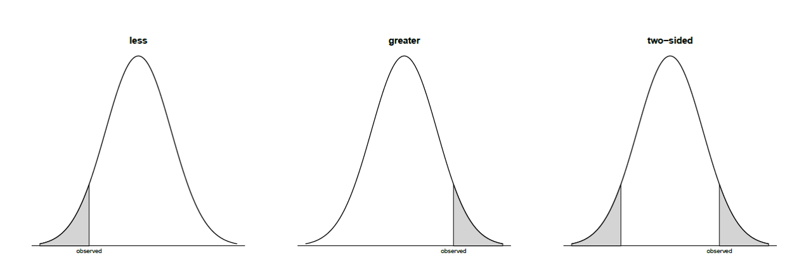
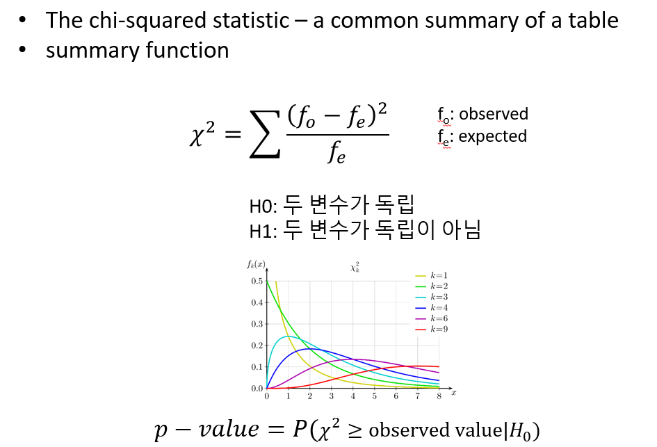

# Significance test

신뢰구간은 통계적 추론의 방법 중 하나이며 유의성검정은 가설을 검정하는 또 다른 추론의 방법입니다. 가설에서는 모수에 대한 특정 값을 가정한 후 이 가설에 기반한 분포로부터 확률을 계산하여 검정을 수행합니다. 

유의성검정을 다음 재판 과정의 검사 입장으로 생각하면 이해가 빠를 수 있습니다. 검사는 피의자가 유죄임을 주장하며 배심원들을 설득합니다. 배심원들은 피의자가 유죄라는 확정적 증거가 없는 한 무고하다는 가정을 하고 있으며 증거가 많아질수록 무죄의 가정이 맞을 확률은 점점 적어집니다. 즉, 확률이 작아질수록 검사가 주장하는 유죄일 확률이 커지게 됩니다. 

유의성검정에서 H0는 귀무가설(Null hypothesis)이고 H1을 대립가설(alternative hypothesis)이라 합니다. 일반적으로 H1이 우리가 관심있는 주장이고 유의성검정을 위해서 우리 주장의 반대인 H0를 가정합니다. 만약 H0 가정 하에서 만들어진 통계량의 관측될 확률이 작으면 H0 가정은 틀린 것으로 기각하고 우리가 주장하는 H1을 채택합니다. 여기서 통계량의 관측될 확률이 유의확률(p-value) 이며 유의성검정은 p-value를 계산하는 것과 같습니다. 

$$
\text{p-value} = P(\text{test statistic is the observed value or is more extreme}|H_0)
$$


p-value의 크고 작음을 판단하는 대략적인 범위는 다음과 같습니다.


유의성검정에서는 H0가 참인지 거짓인지 판별하기 보다는 유의수준(significance level, $\alpha$)이라는 기준에 따라서 H0를 기각할지 안할지를 판단하게 됩니다. 일반적인 유의수준은 0.01, 0.05, 0.1 정도로 p-value가 이들 값보다 작게 나오면 H0를 기각합니다. 

그런데 $\alpha$에 따라서 H0를 기각 할 경우 다음 두 가지오류, 제1종오류 (type-I error)와 제2종오류 (type-II error)가 발생할 수 있습니다. 


앞서 재판의 경우를 예로 들면 제1종오류는 죄가 없는 사람(H0가 참)을 죄가 있다고 판단 (H0기각) 하는 경우로 가능하면 일어나서는 안되는 상황입니다. 따라서 $\alpha$는 보수적인 기준으로 정하게 되나 $\alpha$가 작아지면 자동적으로 $\beta$가 큰 값으로 결정되어 두 오류를 동시에 작게 만족시키는 유의수준은 정하기 어렵습니다. 따라서 가능한 제1종 오류를 작게 유지하면서 power ($1-\beta$)를 가능한 높게 되도록 검정을 디자인할 필요가 있습니다. 

**[Example]** 어떤 기계의 영점이 N(0,1)의 분포를 가지고 영점이 맞지 않을 경우 N(1,1)의 분포를 가진다고 한다. 기계로 부터 측정한 값이 0.7일 경우 기계의 영점이 맞춰져 있는지 아닌지를 판단하시오

$$
H_0: \mu = 0 \text{ vs } H_1: \mu = 1
$$


만약 영점이 맞춰진 상태에서 관측된 값이라면 $Z = {0.7-\mu}/sd = 0.7$ 이므로 p-value는  ```1-pnorm(0.7, 0, 1)=0.2419``` 이며 영점이 맞춰지지 않은 상태에서 구해진 값이라면 $Z={0.7-1}/sd = -0.3$ 이므로 p-value는 ```pnorm(0.7, 1, 1)=0.382``` 입니다. 결국 두 p-value 모두 충분히 작지 않으며 따라서 어느 귀무가설을 기각할지 모호한 상황입니다. 이럴 경우에 1 sd 대신 1/sqrt(n) 값을 사용하면 훨씬더 명확한 판단을 내릴 수 있습니다. 


단계별 p-value 계산하는 방법
 * 데이터에 맞는 분포를 정함
 * H0와 H1를 정함
 * 검정 통계량 정의
 * 데이터 수집
 * 검정 통계량 계산
 * p-value 계산 

## Significance test for a population proportion

실업률 고용률 오르는지, 빈곤율 떨어지는지 등 대부분의 경우 기준이 되는 값이 있고 그 값보다 더 높은지 낮은지를 비교하는 검정을 수행할 수 있습니다. 위 기준이 되는 값을 $p_0$라 하고 우리의 관심을 $p$라 하고 만약 $n$ 번 관찰 중 $x$번을 성공 횟수라 한다면 $\hat{p} = x/n$ 입니다. 보통은 표준화한 값을 통계량으로 사용하고 $Z$는 다음과 같습니다.  

$$
\begin{split}
H_0: p = p_0 \\
H_1: p > p_0, H_1: p < p_0, H_1: p \neq p_0 \\
Z = \frac{\hat{p} - E(\hat{p}|H_0)}{SD(\hat{p}|H_0)} = \frac{\hat{p} - p_0}{\sqrt{p_0(1-p_0)/n}} 
\end{split}
$$




**[Example]** 2000년 빈곤율은 11.7% 였고 2010년 빈곤율은 15.0% 였다. 2011년 빈곤율이 15.13%으로 관측 되었을 때 빈곤율이 증가하는 것인지 검정하시오. n = 150,000. 

* 분포 - 비율 비교 (이항분포)
* H0: 15.0과 같다, H1: 15.0보다 크다 
* 통계량: Z
* 통계량, pvalue계산


$$
\begin{split}
& H_0: p = 0.15 \\
& H_1: p > 0.15 \\
Z &= \frac{0.1513 - 0.15}{\sqrt{0.1513 \times 0.8487 / 150000}} = 1.405 \sim N(0,1)
\end{split}
$$

```{r, eval=F}
library(ggplot2)

phat <- 0.1513
p0 <- 0.15
n <- 150000
SD <- sqrt(p0*(1-p0)/n)
Z <- (phat - p0)/SD
pval <- 1-pnorm(Z)

## plot
x <- seq(-5, 5, length=100)
y <- dnorm(x)
dat <- data.frame(x, y)

x1 <- seq(Z, 5, length=50)
y1 <- dnorm(x1)
dat2 <- data.frame(x=c(Z, x1, Z), y=c(0, y1, 0))

ggplot(dat, aes(x, y)) +
  geom_line() +
  geom_polygon(dat=dat2, aes(x, y)) + 
  annotate("text", label = round(pval,3), x = 3, y = 0.15, size = 8, colour = "red") +
  geom_segment(aes(x = 2.5, y = 0.12, xend = 1.8, yend = 0.05),  arrow = arrow(), color='red',size=1)


```

**[EXERCISE]** 앞서 예제를 ```prop.test``` 를 사용해서 구현하시오 


## Significance test for the mean (t-test)

이번에는 미지의 모평균에 대한 검정을 수행하는 방법을 알아봅니다. 검정 방법은 앞서 배운 비율 검정 과정과 유사하며 통계량은 신뢰구간을 학습할 때 배웠던 계산식과 같습니다.  

$$
\begin{split}
H_0: \mu = \mu_0 \\
H_1: \mu > \mu_0, H_1: \mu < \mu_0, H_1: \mu \neq \mu_0 \\
T = \frac{\bar{x} - E(\bar{x}|H_0)}{SE(\bar{x}|H_0)} = \frac{\bar{x} - \mu_0}{s / \sqrt{n}} = \frac{\text{observed} - \text{expected}}{SE} 
\end{split}
$$

이제 데이터 $x_1, x_2, ..., x_n$을 얻고 이로부터 $t = (\bar{x}-\mu_0)/(s/\sqrt{n})$을 구할 경우 p-value는 다음과 같습니다. 


**[Example]** 새 SUV 자동차의 연비가 17miles / gallon 으로 알려져 있다. 소비자 그룹에서는 그러나 이보다 낮은 것으로 의심하고 있다. 다음 데이터들이 관측 되었을 때 해당 신차의 연비가 17mile 보다 작은지 검정하시오. 

```{r, eval=F}
mpg <- c(11.4, 13.1, 14.7, 14.7, 15, 15.5, 15.6, 15.9, 16, 16.8)
xbar <- mean(mpg)
s <- sd(mpg)
n <- length(mpg)
tstat <- (xbar-17)/(s/sqrt(n))
```


$$
\begin{split}
&H_0: \mu = 17 \\
&H_1: \mu < 17 \\
T &= \frac{14.87 - 17}{1.582 / 3.162} =  -4.284
\end{split}
$$


```{r, eval=F}
library(ggplot2)
x <- seq(-5, 5, length=100)
y <- dt(x, df=n-1)
dat <- data.frame(x, y)
ggplot(dat, aes(x, y)) +
  geom_line() +
  geom_vline(xintercept = tstat)
```


```{r, eval=F}
pt(tstat, df=9, lower.tail=T)
```

```{r, eval=F, echo=F}
t.test(mpg, mu=17, alternative="less")
```

**[EXERCISE]** 위 예제를 ```t.test``` 를 사용해서 구현하시오 


## Two sample test of proportion


**[Example]** 2010년 빈곤율을 160000명에 대해  조사한 결과 15.0% 였다. 2011년 빈곤율은 150000명에 대해 조사해서 15.13%으로 관측 되었을 때 두 빈곤율이 유의한 차이가 있는 것인가? 

* 분포 - 비율 비교
* H0: 2010년과 2011년 빈곤율은 같다. H1: Not H0 
* 통계량: Z
* 통계량, pvalue계산

```{r, eval=F}
phat <- c(0.15, 0.1513)
n <- c(160000, 150000)
n*phat
```

```{r, eval=F}
prop.test(n*phat, n, alternative="less")
```


## Two sample test of center


**[Example]** HIV의 항바이러스제 AZT는 하루 300mg 효과가 있고 그 이상은 부작용이 나타난다고 알려짐. 그러나 높은 농도에서 약효가 더 좋은지를 검정하고자 함. 측정값은 면역반응을 증가시키는 p24 농도를 측정한 값임. 

```{r, eval=F}
m300 <- c(284, 279, 289, 292, 287, 295, 285, 279, 306, 298)
m600 <- c(298, 307, 297, 279, 291, 335, 299, 300, 306, 291)
t.test(m300, m600) 
t.test(m300, m600, var.equal=T) 
```

```{r, eval=F}
plot(density(m300)); lines(density(m600), lty=2)
```

**[Example]** (Paired data) 특정 코스웍이 효과가 있는지를 검증하고자 하는 연구로서 한 학생에 대해서 강의를 듣기 전과 후의 효과를 측정하여 검정을 수행함

```{r, eval=F}
x <- c(5,3,5,7,4,4,7,4,3)
y <- c(2,3,2,4,2,2,3,4,2)
t.test(x, y)
z <- x-y
t.test(z)
t.test(x, y, paired = T)

```

## Association for categorical data

앞서 chapter 4에서 범주형 데이터와 함께 The chi-squared statistics의 간략한 설명이 있었습니다. The chi-squared statistics 는 가장 널리 쓰이는 범주형 자료의 연관성 척도로 다음과 같이 정의됩니다. 수식의 "o"와 "e"는 각각 관측값과 예측값을 나타내며 이 값이 클 경우 연관이 크다는 것 입니다. 

$$ \text{chi-squared statistic } = \sum \frac{(f_o - f_e)^2}{f_e} $$


**[Example]** 다음 seatbelt 데이터에서 만약 부모와 아이들의 안전벨트를 매는 두 사건 (변수)가 독립이라면 $p(C, P) == p(C)p(P)$ 즉, 결합확률이 각 확률을 곱한 것과 같고 기대값은 확률 x 전체 사건의 수($N$) 이므로 다시 적으면 $N p(C,P) == N p(C)p(P)$임. 여기서 $N p(C,P)$는 우리가 관측한 값으로 볼 수 있고 $N p(C) p(P)$는 독립을 가정한 상태에서 기대값이라고 볼 수 있음. 


```{r, eval=F}

fo <- matrix(c(56, 2, 8, 16), nrow=2)
rownames(fo) <- c("buckled","unbuckled")
colnames(fo) <- c("buckled","unbuckled")

## marginal probability
margin_rows <- rowSums(fo)/sum(fo)
margin_cols <- colSums(fo)/sum(fo)

## expected numbers
fe <- matrix(c(0,0,0,0), nrow=2)
fe[1,1] <- sum(fo)*margin_rows[1]*margin_cols[1]
fe[1,2] <- sum(fo)*margin_rows[1]*margin_cols[2]
fe[2,1] <- sum(fo)*margin_rows[2]*margin_cols[1]
fe[2,2] <- sum(fo)*margin_rows[2]*margin_cols[2]
#fe

## use chisq.test function
#(fo-fe)^2 / fe
chistat <- sum((fo-fe)^2 / fe)
df <- (nrow(fo)-1)*(ncol(fo)-1)
1-pchisq(chistat, df)


result <- chisq.test(fo)

```




**[Example]** 한 의학연구가에 의하면 흡연은 눈가에 주름이 지게 하는 요인이 된다고 한다. 이러한 주장이 타당한가를 알아보기 위해 30대 남자 1000명을 랜덤하게 추출하여 조사한 결과 다음과 같은 표를 얻었다. 30대 남자들을 대상으로 볼 때 연구가의 주장이 옳은지 판단하는 연관성을 나타내는 카이제곱 값을 구하라


chistat = 74.9652, pvalue<2.2E-16


## Variable type and testing methods


