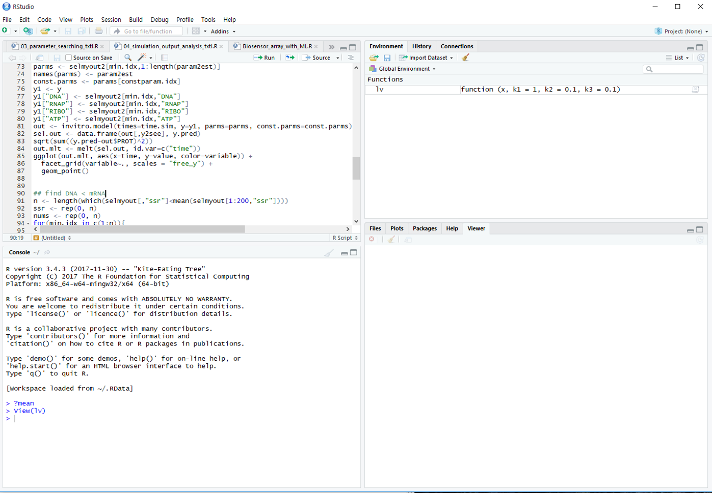
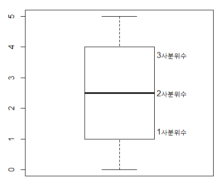

--- 
title: "R로 배우는 기초통계"
author: "한국생명공학연구원 김하성"
date: "`r Sys.Date()`"
site: bookdown::bookdown_site
output: bookdown::gitbook
mainfont: Nanum Myeongjo
documentclass: book
bibliography: [book.bib, packages.bib]
biblio-style: apalike
link-citations: yes
github-repo: rstudio/bookdown-demo
description: "이 강의는 2019년 2학기 UST에서 진행하는 일반강의 입니다."
---


# Introduction 강의 개요 
- 장소: 한국생명공학연구원 연구동 세미나실 1213호 (매주수요일 13:00~16:00)
- 강사: 한국생명공학연구원 바이오합성연구센터 김하성
- 연락처: 042-860-4372, haseong@kribb.re.kr (생명연 연구동 1143)
- 강의site: https://greendaygh.github.io/Rstat2019/ 

## Goal 강의 목표
- 이공계열 대학원생이 보다 쉽게 통계 이론을 습득하고 활용하는 능력을 배양하는데 주요 목적이 있음. 특히 데이터 분석용 프로그래밍언어인 R을 기반으로 한 실습을 통하여 프로그래밍 기술 습득과 함께 데이터를 다루는 능력을 배움으로써 이공계 연구에 있어서 필수인 통계적 사고의 기초를 다지는데 그 목적이 있음. 


## References 참고 자료
<center>

</center>

- Using R for Introductory Statistics by John Verzani
  - Free version of 1st Edition 
    - https://cran.r-project.org/doc/contrib/Verzani-SimpleR.pdf
    - http://cbb.sjtu.edu.cn/~mywu/bi217/usingR.pdf
  - Second edition
    - https://www.crcpress.com/Using-R-for-Introductory-Statistics-Second-Edition/Verzani/p/book/9781466590731
- R for Data Science (https://r4ds.had.co.nz, https://github.com/hadley)
- https://resources.rstudio.com/
- 일반통계학 (영지문화사, 김우철 외)


## Evaluation 평가 세부 항목
- 출석 50% / 과제 50% / 80점 이상 S, 80점 미만 U 부여

## Schedule 강의 계획

- 1주차- R basics / introduction of data 
- 2주차 - Univariate data – Summary statistics 일변량자료 (범주형, 수치형, 분포)
- 3주차 - Bivariate data – Correlation  / Independence  이변량자료 (자료비교, 수치자료의 관계, 단순선형회귀)
- 4주차 - Multivariate data – R data structure 다변량자료 (다변량, R자료형, R그래픽) 
- 5주차 - Populations – Families of distributions 모집단과 분포 
- 6주차 - Sampling – Distribution and CLT 시뮬레이션, 샘플링
- 7주차 - Statistical inference 통계적 추론
- 8주차 - Confidence intervals 신뢰구간 
- 9주차 - Significance test - parameteric 유의성 검정 (모수)
- 10주차 - Significance test – non parametric 유의성 검정 (비모수)
- 11주차 - Goodness of fit - parametric 적합도 검정 (모수) 
- 12주차 - Goodness of fit – non parametirc 적합도 검정 (비모수) 
- 13주차 - Linear regression – basics & simple LR 단순회귀모형 
- 14주차 - Multiple linear regression 다중회귀모형 
- 15주차 - Analysis of variance 분산분석 
- 16주차 - Logistic / Non-linear regression 로지스틱/비선형회귀모형  

- 9/25 휴강 (강사 해외 출장)

## References 참고 자료
- R 홈페이지 https://www.r-project.org/
- Rstudio 홈페이지 https://www.rstudio.com/
- Packages for biologists https://www.bioconductor.org/
- R 기본 문서들 (소개, 사용, 설치, 운영)
  + https://cran.r-project.org/doc/manuals/r-release/R-intro.html
  + https://cran.r-project.org/doc/manuals/r-release/R-data.html
  + https://cran.r-project.org/doc/manuals/r-release/R-admin.html
- R ebooks 
  + https://bookdown.org/
- Cheat Sheets
  + https://www.rstudio.com/resources/cheatsheets/ 
    


<!--chapter:end:index.Rmd-->


# R basics  

## What is R / Rstudio 

<center>

</center>

- R is a programming language that runs computations (https://www.r-project.org/)
- RStudio is an integrated development environment (IDE) that provides an interface for the programming (https://www.rstudio.com/)


## R / Rstudio installation

- Install R first and then install RStudio second
- R 
  
  
  
  
  
 
- Rstudio
  
  
  
  
  


## Rstudio interface


## Keyboard shortcuts

- 참고사이트 
  - https://support.rstudio.com/hc/en-us/articles/200711853-Keyboard-Shortcuts
  - Tools --> Keyboard shortcut Quick Reference (Alt + Shift + K)
- 코드편집창 이동 (Ctrl+1) 콘솔창 이동(Ctrl+2)
- 한 줄 실행 (Ctrl+Enter)
- 주석처리 (Ctrl + Shift + C) 
  - Starting with a hashmark (‘#’), everything to the end of the line is a comment

- 실습

  - 코드편집창에서 다음 입력 
  -   
  - 단축키 Ctrl + enter로 코드 실행 
  - 단축키 Ctrl + 2로 커서 콘솔창으로 이동
  - x값 x+y값 확인 
  - 단축키 Ctrl + 1로 코드편집창 이동 
  - 단축키 Ctrl + Shift + C 사용

```{r, eval=F}
# x <- 10
# y <- 20

```


## R programming basics and terminology

- Console: 명령어 입력하는 창 
- Code: R 프로그래밍 변수/제어문 모음   
- Objects (개체, variable): 값이 (데이터) 저장되는 장소 
- Data types: Integers, doubles/numerics, logicals, and characters.
- Object (Variable) types:
  - Vectors: 값들의 모임 combine function c() EX: c(6, 11, 13, 31, 90, 92)
  - Factors: 범주형 데이터 저장 장소
  - Data frames: 2D matrix 형태 데이터 자장 장소 
- Conditionals (조건, 제어):
  - if: ==, & (AND), | (OR) Ex: (2 + 1 == 3) & (2 + 1 == 4) 
  - for, while: 반복 수
- Functions (함수, commands): 특정 일 수행, 함수이름 - 입력값 (arguments) - 출력값 (output) 으로 구성 

## Set working directory  

- 시작 전 항상 작업 디렉토리 설정 
- 예를 들어 c:\ 아래 새로운 디렉토리 rstat01 을 만들고 작업공간으로 설정  

```{r, eval=FALSE}
getwd()
dir()
setwd("C:\\rstat01")
getwd()
dir()
```

- 또는 아래와 같이 RStudio 메뉴 에서 설정 
  


## R coding practice 

- 콘솔 계산기 
```{r, eval=FALSE}
2 + 2
((2 – 1)^2 + (1 – 3)^2 )^(1/2)
2 + 2; 2 - 2
```
- 이전 명령: 콘솔에서 위 아래 화살표  


## Variables and values 

- R is a programming language 
- Assignment operator ( `<-` OR `=` )
  - Valid object name `<-` value 
  - 단축키: `Alt + -` (the minus sign)
- 내장 변수 Built-in variables

```{r, eval=FALSE}
x <- 2
y <- x^2 – 2*x + 1
y
x <- "two"  
some_data <- 9.8
pi
```

- 변수이름 작명법 
  - Characters (letters), numbers,  “_”,  “.”
  - A and a are different symbols
  - Names are effectively unlimited in length

```{r, eval=F}
i_use_snake_case <- 1
otherPeopleUseCamelCase <- 2
some.people.use.periods <- 3
And_aFew.People_RENOUNCEconvention <- 4
```

- 자동 완성 기능 (Tab completion) in RStudio


## Variable type of (storage) mode


## Variable - Vectors 

- Combine function `c()`: Concatenating elements end to end

```{r, eval=FALSE}
x <- c(10.4, 5.6, 3.1, 6.4, 21.7) 
y <- c("X1", "Y2",  "X3",  "Y4")
```

- 인덱싱: Subsets of the elements of a vector 

```{r, eval=F}
x[1]
x[1:3]
x[c(1,2,4)]
y[3]
```


## Functions

- Function define

```{r, eval=FALSE}
my_sine <- function(x){
	y <- sin(x)
	return(y)
}
```

- Usage

```{r, eval=F}
my_sine(pi)
```

- Terminology 
  - function name: `my_sine`
  - parameter: `x`
  - argument: `pi`
  - return value: `y`


- Built-in functions
  - Arguments separated by commas
  - Tab completion


```{r, eval=F}
x <- pi
sin(x)
sqrt(x)
log(x)
log(x, 10)
x <- c(10, 20, 30)
x + x
mean(x)
sum(x)/length(x)
```


## Vectorized functions

```{r, eval=F}
x <- c(10, 20, 30)
x + x
sqrt(x)
sin(x)
log(x)
x-mean(x)
```


## Help

- R의 장점 중 하나 (예제 포함)

```{r, eval=F}
?
?mean
help("mean")
example("mean")
help.search("mean")
help(package="MASS")
```


## RStudio workspace




## R packages

- R comes ready loaded with various libraries of functions called packages
 + ex) sum() is in the “base” package and sd() in the “stats” package
- The packages can be found in numerous server locations on the web called repositories
 + The Comprehensive R Archive Network (CRAN) http://cran.r-project.org/web/views/
 + Bioconductor specialised in genomics http://www.bioconductor.org/packages/release/bioc/
 


- UsingR package installation


- UsingR package loading

```{r, eval=F}
library(UsingR)
```

- R 설치 디렉토리
- R 패키지 설치 디렉토리

```{r, eval=F}
.libPaths()
path.package()
```


## Data sets

- Packages include accompanying data sets
- R has a datasets package that is loaded automatically
- The data function  produces a copy of dataset in user’s workspace

```{r, eval=F}
head(rivers)
length(rivers)
class(rivers)
data(rivers)
data(package="UsingR")
library(HistData)
head(Cavendish)
str(Cavendish)
head(Cavendish$density2)
```


## Cheatsheet


<!--chapter:end:02-Rintro.Rmd-->


# Univariat data

## Introduction
- Statistics 
  + 데이터 분석을 통한 예측 - 데이터를 수집, 정리하여 이로부터 미지의 사실에 대한 신빙성 있는 추론을 수행하는 과정


- Data - 사실을 나타내는 수치 
- 맥도너 정보경제학 (1963)
  + 지혜 (wisdom) : 패턴화된 지식
  + 지식 (knowledge) : 가치있는 정보
  + 정보 (information) : 의미있는 데이터
  + 데이터 (data) : 단순한 사실의 나열

- Univariate: Single variable 
- Data collection process
  - Case: One of several different possible items of interest
  - Variable: Some measurement of a case
  - Univariate data set: A set of measurements for a variable  

$$ x_1, x_2, ..., x_n $$
```{r, eval=F}
library(UsingR)
exec.pay
?exec.pay
```


- Levels of measurement 
  + Nominal (명목형) – 사람 이름
  + Ordinal (순서형) – 달리기 도착 순서
  + Interval (구간형) – 선수1, 선수2 종점통과 시간
  + Ratio (비율형) – 출발시간 기준 종점 통과 시간


- Data type in R
  + Numeric data types 
    + Discrete (이산형) data - 카운트, 횟수
    + Continuous (연속형) data - 키, 몸무게, Cannot be shared
  + Factors data - Categories to group the data
  + Character data - Identifiers 
  + Date and time
  + Hierarchical data - 네트워크 구조 

## Data vectors

- Using combine function 

```{r, eval=F}
#The number of whale beachings in Texas during the 1990s
whale <- c(74, 122, 235, 111, 292, 111, 211, 133, 156, 79)
#Object `whale` is a data vector == (univariate) data set

# The size 
length(whale)
sum(whale)
sum(whale)/length(whale)
mean(whale)
```


- Vectorization

```{r, eval=F}
whale - mean(whale)
whale^2 - mean(whale)
sqrt(whale)
```


- Adding values to a vector variable

```{r, eval=F}
x <- 1
x <- c(x, 2)
x
x <- c(x, 3, 3, 3, 4)
x
```


- Missing/NULL values
  + NA: Not available, The value is missing 
  + NULL: a reserved value
  + NaN: Not a number (0/0)
  + Inf: (1/0)

```{r, eval=F}
hip_cost <- c(10500, 45000, 74100, NA, 83500)
sum(hip_cost)
sum(hip_cost, na.rm=TRUE)
?sum
```

- Attributes: names in data vectors

```{r, eval=F}
head(precip)
class(precip)
length(precip)
names(precip)
order(names(precip))

test_scores <- c(100, 90, 80)
names(test_scores) <- c("Alice", "Bob", "Shirley")
```

- Indexing 

```{r, eval=F}
head(precip)
precip[1]
precip[2:10]
precip[c(1,3,5)]
precip[-1]
precip["Seattle Tacoma"]
precip[c("Seattle Tacoma", "Portland")]
precip[2] <- 10
```


- Functions for generating structured data

```{r, eval=F}
1:5
seq(1,5, by=1)
seq(0, 100, by=10)
seq(0, 100, length.out=11)
?seq
rep(5, times10)
rep(1:3, times=4)
```


## Data type 
 - Numeric data
```{r, eval=F}
class(1)
class(pi)
class(seq(1,5,by=1))
```
 
 - Character data
```{r, eval=F}
ch <- c("Lincoln", "said", "and")
class(ch)
```
 - Combining strings - paste function
```{r, eval=F}
paste("X", 1:10)
paste("X", 1:10, sep="")
paste("The", "quick", "brown", "fox")
paste(c("The", "quick", "brown", "fox"))
paste(c("The", "quick", "brown", "fox"), collapse=" ")
x <- 1:10
paste(x)
paste(x, collapse=":")
```

 - Factors 
```{r, eval=F}
x <- c("Red", "Blue", "Yellow", "Green", "Blue", "Green")
y <- factor(x)
y
```
 
- Adding a level 
```{r, eval=F}
levels(y)
y[1] <- "Gold"
y
```
```{r, eval=F}
levels(y) <- c(levels(y), "Gold")
levels(y)
y
y[1] <- "Gold"
y
```
 - Odered factors (ex. 위치 바꾸기)
 
```{r, eval=F}
#library(UsingR)
str(Cars93)
x <- Cars93$Origin
plot(x)
levels(x) <- c("non-USA", "USA")
levels(x)
plot(x)
```
 
 - Logical data
   + TRUE and FALSE
   + "is" functions
   + Comparison by `<`, `<=`, `==`, `!=`, `>=`, `>`
   + Combination by `!`, `&`, `|`

```{r, eval=F}
is.na(1)
is.numeric(1)
is.logical(TRUE)

pi < 3
precip < 30
which(precip < 30)
any(precip < 30)
all(precip < 30)
any(39 == precip)
which(39 == precip)
sum(precip < 30)
sum(c(TRUE, TRUE))

x <- Cars93$Origin
x == "USA" 
which(x == "USA")
i <- which(x == "USA")
x[i]

x <- 1:100
x < 10
x > 90
x < 10 | x >90
which(x < 10 | x >90)
i <- which(x < 10 | x >90)
x[i]
x[x < 10 | x >90]
```


- Date and time
  + Unixtime, POSIX time
  + 1970년 1월 1일 00:00:00 협정 세계시(UTC) 부터의 경과 시간을 초로 환산 
  + 32비트로 표현된 유닉스 시간은 1970년 1월 1일 00:00 (UTC)에서 2,147,483,647 (231 - 1) 지난 후인 2038년 1월 19일 03:14:08 UTC에 2038년 문제를 발생시킨다. 이는 산술 오버플로와 관련 있는 문제이다. –wiki- 


```{r, eval=F}
library(lubridate)
current_time <- now() # record since 1970
as.numeric(current_time)
as.numeric(now())
month(current_time)
```


### Example - Recoding values  
다음은 신생아들의 키를 나타내는 data set 이다. 오류 값을 찾아내고 이들 값을 `NA`로 바꾼 후 평균 값을 구하라. 
```{r, eval=F}
x <- babies$dwt
x
```


### Example - Average distance from center  


\begin{equation}
(| x_1 - \bar{x} | + |x_2 - \bar{x}| + ... + |x_n - \bar{x}| )/n
\end{equation}

```{r, eval=F}
x <- rivers

```


## Functions

- Define a function

```{r, eval=F}

my_mean <- function(x){
	total <- sum(x)
	n <- length(x)
	return(total/n)
}

```

- Write a function named `get_dist` for the example 3.3.2, and use it for the `rivers` data

```{r, eval=F}

get_dist <- function(x){
	return()
}

```


## Numeric summaries
<center>


<br>
<br>

</center>

- 대푯값 
- Center – commonly known as “average” or “mean” but not the only one. 
  + median, mode, etc
  
- Spread – Variability of a data set. 
  + No variability – mean is everything 
  + Large variability – mean informs much less
  + confidence of interpretation from knowing center
  + Distance from center
  
- Shape – Degree of interpretation from knowing center and spread. 
  + eg. bell shape – two sides are equally likely, large values are rather unlikely and values tend to cluster near the center.


## Center

<center>

</center>

### Sample mean
$$ \bar{x} = \frac{1}{n} (x_1 + x_2 + ... + x_n) = \frac{1}{n}\sum_i{x_i} $$

```{r, eval=F}
head(kid.weights)
str(kid.weights)
wts <- kid.weights$weight
length(wts)
plot(wts)
mean(wts)
devs <- wts – mean(wts) # deviation, centering
plot(wts)
mean(wts)
```
- Trimmed mean

```{r, eval=F}
mean(wts)
wts[wts<120]
mean(wts[wts<=120])
mean(wts, trim=0.8)
```

### Measure of Position

- _p_th Quantile - 특정 값으로 이 값보다 작은 데이터의 비율이 100∙p 퍼센트, 큰 데이터의 비율은 100∙(1- p) 퍼센트 
- Median - Splits the data in half _p_=0.5
- Percentiles - The same as quantile but its scale is 0 to 100

```{r, eval=F}
x <- 0:5
length(x)
quantile(x, 0.25)
median(x)
quantile(x, seq(0, 1, by=0.2))
quantile(x)
```

- Robustness 

```{r, eval=F}
mean(wts)
median(wts)
plot(wts)
abline(h=mean(wts), col="red")
abline(h=median(wts), col="blue")
wts2 <- wts[wts<120]
abline(h=mean(wts2), col="red", lty=2)
```

- Boxplot

```{r, eval=F}
x <- 0:5
quantile(x)
boxplot(x)
text(x=1.3, y=quantile(x, 0.25), labels = "1사분위수")
text(x=1.3, y=quantile(x, 0.5), labels = "2사분위수")
text(x=1.3, y=quantile(x, 0.75), labels = "3사분위수")
```




## Spread 

<center>

</center>

- Range - the distance between the smallest and largest values 
- Sample variance 
  + Distance - $$ d_i = x_i - \bar{x} $$

\begin{equation}
 s^2 = \frac{1}{n-1}\sum_i(x_i - \bar{x})^2
\end{equation}

- Sample standard deviation
  + 측정값들이 평균에서 떨어진 정도 
\begin{equation}
 \sqrt{s^2} = sqrt{ \frac{1}{n-1}\sum_i(x_i - \bar{x})^2 }
\end{equation}

  
```{r, eval=F}
wts <- kid.weights$weight
var(wts)
sd(wts)

plot(wts)
boxplot(wts)
hist(wts)
hist(wts, breaks = 50)
hist(wts, 50)
abline(v=mean(wts), col="red")
```

- z-score 
  + How big (small) is the value relative to the others
  + $z=3$ 이 값은 평균에 비해 3 표준편차만큼 크다 

\begin{equation}
 z_i = \frac{x_i - \bar{x}}{s}
\end{equation}


- Example - z score
wts의 z 값을 구하는 함수를 만들고 histogram을 그리시오  

```{r, eval=F}
wts <- kid.weights$weight
```


- Interquartile range (IQR) 
  + Middle 50% of the data
  + Difference between Q3 and Q1

<center>

</center>

- Example - IQR  
wts 변수 값들의 IQR 을 구하시오 

```{r, eval=F}
wts <- kid.weights$weight
```


## Shape

<center>

</center>
 
- Symmetry and skew

\begin{equation}
 sample skewness = \sqrt{n} \frac{\sum{(x_i - \bar{x})^2}}{(\sum{(x_i - \bar{x})^2)^{3/2}}} = \frac{1}{n}\sum{z_i^3}
\end{equation}


```{r, eval=F}
myskew <- function(x){
  n <- length(x)
  z <- (x-mean(x))/sd(x)
  return(sum(z^3)/n)
}

wts <- kid.weights$weight
hist(wts, 50)
myskew(wts)

z <- rnorm(length(wts))
hist(z, br=50)
myskew(z)
```

- Sample excess kurtosis 
  + Measure of tails
  
\begin{equation}
 sample excess kurtosis = n \frac{\sum{(x_i - \bar{x})^4}}{(\sum{(x_i - \bar{x})^2)^2}} -3 = \frac{1}{n}\sum{z_i^4} - 3
\end{equation}

```{r, eval=F}
mykurtosis <- function(x){
  n <- length(x)
  z <- (x-mean(x))/sd(x)
  return(sum(z^4)/n - 3)
}

wts <- kid.weights$weight
hist(wts, 50)
mykurtosis(wts)

z <- rnorm(length(wts))
hist(z, br=50)
mykurtosis(z)
```

## Viewing the shape

- Dot plots – Trouble with repeated values, only used for small data sets
- Stem and leaf plot – Shows range, median, shape. But only for small data sets. trouble with clustered data. Rounding
- Histogram – Break up an interval, for each subinterval the number of data points are counted
- Density plots 

```{r, eval=F}
wts <- kid.weights$weight
xrange <- range(wts)
den <- density(wts)
plot(den, xlim=xrange, xlab="densities", main="")
```


- Boxplots 
  + It shows center, spread, shape
  + Five-number summary of a univariate data set: min, max, Q1, Q3, and median
  + These are good summary of even very large data sets. 
  + Outliers – 1.5 x IQR 


## Categorical data

- Tabulating data

```{r, eval=F}

x <- babies$smoke
x <- factor(x, labels=c("never", "now", "until current", "once, quit", "unknown"))
table(x)
out <- table(x)
prop <- 100*out/sum(out)
round(prop, digits=2)
barplot(out)
barplot(prop)
dotplot(out)
dotplot(prop)
pie(out)

```


<!--chapter:end:03-univar.Rmd-->


# Bivariate data

## Introduction

본 단원에서는 두 변수를 동시에 고려할 경우 각 변수가 가지고 있는 데이터를 비교하여 변수간의 유사성이나 관계 (상관, 독립)에 대한 설명하는 방법을 소개하며 짝데이터 (Paired data)나 범주형 데이터의 경우에 두 변수의 관계를 어떻게 설명하는지 알아봅니다. 또한 그래프를 이용하여 두 변수의 관계를 가시화 하는 방법에 대해 알아보겠습니다.  


### Independence samples


위 그림은 두 변수간 (x, y축) 관계를 산점도와 marginal histogram을 이용하여 비교한 그림 입니다. Marginal histogram은 두 그래프가 비슷한 모양을 하고 있지만 왼쪽 그림은 두 변수간 강한 양의 상관관계를 보여주고 있으며 오른쪽은 두 변수가 아무런 관계도 아닌 독립임을 보여줍니다.


두 변수간의 관계를 설명할 때 가장 일반적인 경우의 데이터 형태는 코흐트 데이터 입니다. 처리군과 대조군으로 이루어진 데이터를 말하며 플라시보 (Placebo effect) 효과를 방지하기 위해서 실제 효과는 없지만 대조군에 처리한 조건과 동일한 조건의 처리를 수행합니다. 

```{r, eval=F}
beets <- c(41, 40, 41, 42, 44, 35, 41, 36, 47, 45)
no_beets <- c(51, 51, 50, 42, 40, 31, 43, 45)
```

위 데이터는 비트의 효과를 검증하기 위해  각 실험자의 달리는 시간을 측정하고 비교한 데이터 입니다. 이 데이터를 보고 알 수 있는 사실은 무엇이 있을까요? 우리가 앞서 단원에서 대푯값을 배웠으니 이를 고려해서 질문을 다시 생각해 봅시다. 

- 가장 오래 달린 세 명이 no beet 그룹에 있음
- 가장 적게 달린 한 사람이 beet 그룹에 있음
- center, spread 또는 shape가 유사한가? 


이 후 단원에서 randomness가 가정된 상태에서 위 질문들에 대한 해답을 찾는 과정을 배우게 될 것입니다.  

### plot

두 변수에 대한 관계를 가장 먼저 그리고 가장 직관적으로 설명하는 방법은 그래프 입니다. 줄기잎 차트나 `dot-plot` 등은 많이 쓰이지 않으나 `boxplot`과 산점도는 (`dot-plot`) 데이터 분석을 수행하기 전에 변수들간의 관계를 대략적으로 가늠해 볼 수 있기 때문에 많이 사용되고 있습니다. 


```{r, eval=F}
dotchart(c(beets, no_beets))
dotchart(c(beets, no_beets), groups=factor(c(rep("beets", length(beets)), rep("no_beets", length(no_beets)))))
```

`boxplot`에서는 대략 다섯 가지 대표값을 볼 수 있습니다. 1사분위수, 2사분위수(중간값), 3사분위수, 그리고 최대, 최소값입니다. 여기서 최대 최소는 IQR 1.5배에 해당하는 하위 또는 상위 값으로 그 범위를 벗어나는 값들은 outlier로 취급합니다. 


```{r, eval=F}
boxplot(beets, no_beets)
 boxplot(beets, no_beets, names=c("beets", "no_beets"))
```


`Density plot`은 histogram과 비슷하게 데이터의 center, spread, 그리고 shape를 모두 보여주는 높은 활용도 때문에 많이 사용되는 그래프 입니다. 지난 시간 `R`의 `density` 함수를 활용하여 그리는 방법을 간단히 알아본 바와 같이 density 함수는 밀도함수를 추정하고 주어진 범위의 x값과 그에 대한 y값을 반환해주며 plot 함수를 이용하여 x와 y위치에 점이나 선을 그려주어 그래프를 완성합니다. 


```{r, eval=F}
library(UsingR)
head(michelson)
?michelson
str(michelson)
speed <- michelson$Speed 
expt <- michelson$Expt
fourth <- speed[expt == 4]
fifth <- speed[expt == 5]
d4 <- density(fourth)
d5 <- density(fifth)
xrange <- range(c(d4$x, d5$x))
yrange <- range(c(d4$y, d5$y))
plot(d4, xlim=xrange, ylim=yrange, xlab="densities", main="")
lines(d5, lty=2)
legend(650, 0.008, legend=c("Fourth", "Fifth"), lty=c(1,2))
```

```{r, eval=F}
plot(fourth, fifth)
```


QQplot은 두 변수가 갖는 데이터의 Quantile 값을 비교하는 그래프로 R의 `qqplot` 함수를 사용합니다.

```{r, eval=F}
qqplot(fourth, fifth)
ps <- seq(0.05, 0.95, by=0.05)
x <- quantile(fourth, ps)
y <- quantile(fifth, ps)
plot(x, y)

o <- order(fourth)
fourth[o]
fourth
```


## Data manipulation

### List

R언어에서 두 변수를 담을 수 있는 데이터 타입은 `list`와 `data frame` 두 종류가 있습니다. `list` 변수 타입은 `vector` 형태의 여러개의 element를 가질 수 있으며 각 element의 데이터는 문자나 숫자 어떤 데이터 타입도 가능하며 각 element vector의 길이가 모두 달라도 됩니다. list의 인덱싱에서 `[` `]`는 리스트를 반환하고 `[[` `]]`는 vector element들을 반환합니다. 


```{r, eval=F}
b <- list(beets = beets, "no beets"=no_beets)
b$beets
b[1]
b[[1]]
class(b[1])
class(b[[1]])
boxplot(b)
```


### Data frame 

`data.frame` 타입 변수는 list와 같은 기능의 타입으로 볼 수 있지만 모든 element 들이 같은 길이를 갖는다는 것이 다릅니다. 따라서 2차원 메트릭스 형태로 표현될 수 있으며 matrix와 같이 `[가로, 세로]` 방식으로 인덱싱 할 수 있습니다. 각 row는 샘플을 나타내고 column은 하나의 변수를 타나냅니다. R 기반의 데이터 분석에서는 가장 선호되는 데이터 타입이라고 볼 수 있습니다. 


```{r, eval=F}
id <- 1:10
name <- paste("Name", id, sep="")
grade <- LETTERS[sample(1:5, size=length(id), replace=T)]
student <- data.frame(id, name, grade)
student

student$id
student[,1]
class(student$name)
str(student)

class(id)
class(name)
class(grade)
class(student)
class(student[,1])
class(student[,3])
student <- data.frame(id, name, grade, stringsAsFactors = F)

```


### Model formulas


R에서는 두 변수의 관계를 수학적으로 표현하기 위한 방법을 제공하며 다양한 모형에서 공통적으로 사용될 수 있습니다. 


$$ response(s) \sim predictor(s) $$


```{r, eval=F}
head(michelson)
beets
no_beets
runtime <- c(beets, no_beets)
nitrate <- c(rep("beets", length(beets)), rep("nobeets", length(no_beets)))
food.sports <- data.frame(runtime, nitrate)
boxplot(runtime~nitrate, data=food.sports)
boxplot(michelson$Speed ~ michelson$Expt)
boxplot(Speed ~ Expt, data=michelson)
```

R에서 `plot`함수는 `Generic function`으로서 입력 파라메터가 갖는 데이터 타입에 따라서 다른 기능을 수행할 수 있습니다. 예를 들어 `formula type`으로 $x \sim  f$ 가 들어갈 경우 그룹별로 boxplot을 나란히 그려주며 따라서 그룹별로 데이터가 얼마나 다른지 한 눈에 비교할 수 있습니다. 


```{r, eval=F}
plot(Speed ~ Expt, data=michelson)
out <- summary(Speed ~ Expt, data=michelson)
plot(out)
plot(michelson$Speed)
plot(michelson$Speed, main="Speed", ylab="Speed", bty="l", pch="*", cex=2, col="red")
?pch
```
  


Stack 함수는 관측 값을 하나의 벡터로 만들고 각 벡터의 라벨을 또 하나의 벡터로 만들어서 합해주는 기능을 수행합니다. 이는 다음에 배울 reshape2 패키지의 melt 와 비슷한 기능을 하고 있습니다. 


Split 함수의 경우 data를 정의된 그룹으로 나누고 list 타입으로 반환해줍니다. 그룹은 factor 형으로 정의된 변수에 저장되어 있어야 합니다. 

```{r}
str(twins)
boxplot(data.frame(twins$Foster, twins$Biological))
```


```{r, eval=F}
b <- list("beets" = beets, "no beets" = no_beets)
stacked <- stack(b)
plot(values ~ ind, data=stacked)

?split
speeds <- split(michelson$Speed, michelson$Expt)
names(speeds) <- paste("Expt", 1:5, sep="")
speeds

speed <- michelson$Speed
expt <- michelson$Expt
speed
expt
speeds <- list(speed[expt==1], speed[expt==2], speed[expt==3], speed[expt==4], speed[expt==5])
names(speeds) <- paste("Expt", 1:5, sep="")
speeds

```

### Example 3-1

- 다음 데이터를 list 타입의 변수를 이용해서 저장하시오 
  - marsha: 25, 0, 45, 90, 0
  - bill: 30, 30, 30, 30
  - holly: 15, 0, 90, 0 
  
- `Hmisc` 패키지를 읽고 michelson 데이터를 `Speed ~ Expt` model formular 를 사용해서 어떤 ouput이 나오는지 설명하시오 


```{r, eval=F}
library(Hmisc)
michelson

summary(Speed~Expt, michelson)
```


- twins 데이터에서 Foster와 Biological 데이터에 대한 boxplot을 그리고 두 데이터의 center와 spread를 비교하시오  


## Paired data 

paired data는 두 종류의 변수에 대한 데이터를 하나의 샘플로 부터 얻을 때의 데이터를 말합니다. 본 단원에서 두 변수의 데이터형은 연속형과 연속형, 또는 연속형과 범주형의 경우로 다음 단원에서 범주형과 범주형에 대한 경우의 두 변수간 관계를 설명하겠습니다. 


예를 들어 한 학생으로부터 얻어진 키와 몸무게 데이터가 paired data가 될 수 있습니다. paired data는 보통 다음과 같은 형태를 취하고 있습니다. 

$$ (x_1, y_1), (x_2, y_2), ..., (x_{252}, y_{252})  $$ 


걸리버 여행기라는 (1726) 소설이 나올 무렵의 사람들은 손목과 목, 허리 둘래가 항상 일정 비율로 비례하는 것을 알고 있었는데 이를 Lilliputians’ hypothesis라고 합니다. 이를 fat 데이터를 통해 알아 봅니다. 


`UsingR` 패키지의 `fat` 데이터는 252명의 남성으로부터 얻어진 다른 신체 부위의 측정 값을 제공하고 있으며 fat index를 예측하기 위한 목적으로 사용될 수 있습니다. 본 강의에서는 neck과 wrist 두 변수간의 관계를 설명하기 위한 데이터로 사용됩니다. 


```{r, eval=F}
library(UsingR)
class(fat)
head(fat)
names(fat)

neck_pair <- fat$neck
wrist_pair <- fat$wrist
mean(neck_pair/wrist_pair)
mean(neck_pair)/mean(wrist_pair)
plot(neck_pair, wrist_pair)

```


손목과 목 둘레를 측정한 데이터의 대표값 (평군)을 이용하여 두 변수 사이의 비율을 계산해 보면 2.084로 거의 두 배의 비율을 보입니다. 짝 데이터가 아닌 경우의 비율은 어떻게 될지 계산해 보면 아래와 같이 2.08로 비슷한 값이 구해집니다. 그러나 plot을 사용해서 산점도를 그려보면 nopair 데이터의 경우 두 변수의 상관성이 사라지는 것을 알 수 있습니다. 


```{r, eval=F}
neck_nopair <-sample(fat$neck)
wrist_nopair <- sample(fat$wrist)
mean(neck_nopair)/mean(wrist_nopair)
mean(neck_nopair/wrist_nopair)
plot(neck_nopair, wrist_nopair)
```


### Pearson Correlation

`상관` 또는 `상관계수`는 두 변수의 선형적 관계를 정량적으로 나타내는 척도입니다. 상관계수의 값이 `0`일 경우 두 변수는 `독립 (independence)`이라고 할 수 있고 선형 관계에 대해서만 사용됩니다. 


```{r, eval=F}
x <- fat$wrist
y <- fat$neck
plot(x, y)
abline(v = mean(x), lty=2)
abline(h = mean(y), lty=2)
points(mean(x), mean(y), pch=16, cex=4, col="#00000055")
abline(lm(y~x))

```


공분산 (covariance)와 상관 (correlation)은 데이터의 중앙을 기준으로 4개의 구역에 각 데이터가 흩어진 정도를 정량화 한 것이며 다음과 같이 정의됩니다. 


$$ cov(x, y) = \frac{1}{n-1} \sum{(x_i-\bar{x})(y_i-\bar{y})} $$

$$ cor(x, y) = \frac{1}{n-1} \sum{(\frac{x_i-\bar{x}}{s_x})(\frac{y_i-\bar{y}}{s_y})} = cov(x,y)/(s_x s_y)$$

```{r, eval=F}
cor(fat$wrist, fat$neck)
cor(fat$wrist, fat$height)
cor(fat$age, fat$ankle)
```

### Spearman correlation coefficient

피어슨 상관계수는 선형적 관계에 대한 정량화만 가능한 반면 spearman 상관계수는 선형관계 뿐만 아니라 비선형 적인 관계에 대해서도 단조 증가나 감소에 대한 정보를 측정할 수 있는 measure 입니다. 이는 데이터의 값 자체를 사용하기 보다는 데이터를 rank 값으로 변환한 후 상관성을 비교하기 때문에 가능한 기능입니다. 


```{r, eval=F}
x <- Animals$body
y <- Animals$brain
cor(x, y)
plot(x, y)
Animals
cor(rank(x), rank(y))
cor(x, y, method="spearman") 
```

Animals 데이터에서 correlation 값이 낮은 이유는 공룡과 같이 뇌 무게에 비해 비정상적으로 큰 몸무게 값을 갖는 개체들 때문입니다. 


- Example: 공룡을 제외한 correlation을 구하시오 


일반적으로 분석의 신뢰성을 높이기 위해 실험 반복을 통해 데이터를 수집합니다. 그런데 가끔은 전체 반복 데이터를 모두 사용해서 상관계수를 구하는 값보다 각 반복 데이터의 평균에 대한 상관 계수를 구랗 때 더 높은 상관 관계를 확인할 수 있습니다. 

```{r, eval=F}

ToothGrowth

plot(ToothGrowth$dose, ToothGrowth$len)
cor(ToothGrowth$dose, ToothGrowth$len)
l <- split(ToothGrowth$len, ToothGrowth$dose)
group_means <- c(mean(l[[1]]), mean(l[[2]]), mean(l[[3]]))

points(c(0.5, 1, 2), group_means, col="red", pch=17, cex=2)
cor(c(0.5, 1, 2), group_means)

```


### Correlation, causation and association

상관성 분석 중 유의할 점 중 하나는 상관성이 인과 관계를 의미하지 않는 다는 점 입니다. Smoking vs. cancer (1950) 연구의 경우 폐암 발병의 원인으로 담배에 대한 입장이 Industry 입장에서의 견해와 health care researchers 입장에서 견해가 다를 수 있습니다. `Lurking variables` 또는 `compounding effect`라고 불리우는 효과는 원인과 결과가 되는 두 요소에 모두 상관성을 갖는 변수로서 당시 담배가 폐암에 원인인지 아닌지에 대한 논란을 일으켰습니다. 


Simpson’s paradox 현상은 전체 데이터의 상관성이 하위 그룹별로 고려한 상관성과 반대가 되는 경우를 말합니다. 

```{r, eval=F}
cor(SAT$salary, SAT$total)
plot(salary~total, data=SAT, cex=2)
points(salary~total, SAT, subset = perc < 10,  col="red", pch=15, cex=2)
points(salary~total, SAT, subset = perc > 40, col="blue", pch=16, cex=2)
abline(lm(SAT$salary~SAT$total))
abline(lm(salary~total, SAT, subset = perc < 10),  col="red")
abline(lm(salary~total, SAT, subset = perc > 40),  col="blue")

```


반응변수 y와 설명변수 x의 관계는 다음 그림과 같은 경우의 수를 생각할 수 있습니다. 


직접적 원인에 의한 결과를 설명하는 인과관계로 설명이 어렬울 경우 좀 더 넓은 범위의 연관성(Association) 으로 두 변수가 관련이 있음을 표현하는 것도 하나의 방법입니다. 1996년 오스트레일리아의 총기 소유자들에게 총기를 다시 사들이는 정부 정책과 자살율에 관한 연구가 그 예제 입니다. 


### Trends

앞서 상관계수는 두 (연속형) 변수간의 관계를 나타내는 척도라고 설명을 했습니다. 하나의 변수는 연속형이고 다른 변수가 범주형 변수일 경우에도 각 범주형 변수의 그룹이 값는 평균값을 비교하여 관계를 유추할 수 있습니다. 즉, 각 그룹의 평균값들을 선으로 연결하였을 때 그 기울기가 일정하면 그룹의 변화에 따른 반응값이 선형적으로 일정한 관계에 있다고 해석할 수 있습니다. 선형적 트렌드는 다음과 같은 모형으로 나타낼 수 있습니다. 

$$ \mu_{y|x} = \beta_0 + \beta_1 x $$ 

여기서 $\mu_{y|x}$ 는 설명변수 $x$ 가 주어진 상태에서 반응변수의 평균으로 볼 수 있습니다. 각 데이터포인트의 경우 $$y_i = \beta_0 + \beta_1 x_i + e_i$$ 이며 $e_i$는 에러를 나타냅니다. $\beta$ 값들은 계산을 해야 알 수 있지만 0일 경우 $y$ 값은 항상 일정하고 에러의 평균은 0이 됨을 가정하고 있습니다.  


이제 $\beta$가 0인지 아닌지를 계산하면 두 변수가 연관이 있는지에 대한 판단을 할 수 있습니다. $\beta$를 구하기 전에 우선 `error`, `residual`, 그리고 `bias` 에 대한 념을 정확히 알아두는 것이 좋습니다. 


### The method of least squares

정의에 의해서 잔차는 다음과 같습니다. 즉 잔차는 관측값에서 추정된값과의 차이입니다. 

$$ \hat{y}_i = b_0 + b_1 x_i $$
$$ residual = y_i - \hat{y}_i $$

$\beta$ 값은 최소제곱추정법이라는 방법으로 구할 수 있는데 이 방법은 각 점에서의 잔차를 최소화 하는 선분을 (회귀선) 구하는 과정이며 $\beta$는 해당 선분의 기울기로 볼 수 있습니다. 즉, 추정에 의해서 구해진 회귀선은 `squared residual`을 최소화 하는 선분이라고 해석할 수 있습니다. 


 


선분 $\hat{y} = \hat{\beta}_0 + \hat{\beta}_1 x$의 최소 제곱법에 의한 $\beta_0$와 $\beta_1$의 추정값 $\hat{\beta}_0$와 $\hat{\beta}_1$은 다음과 같이 정의 됩니다. 


$$ \hat{\beta}_1 = \frac{\sum(x_i - \bar{x})(y_i-\bar{y})}{\sum(x_i - \bar{x})^2} = cor(x,y)\frac{s_y}{s_x}$$

$$ \hat{\beta}_0 = \hat{y} - \hat{\beta}_1 x $$


위 두 식에서 회귀선분의 기울기인 $\hat{\beta}_1$은 상관계수에 $s_y / s_x$를 곱한 수로 1만큼 x 축으로 변할 때 변화하는 y 값의 평균 변화량으로 해석하면 되겠습니다. 또한 상관계수와는 달리 설명변수와 반응변수인 $x$와 $y$가 바뀔경우 값이 달라지며 여전히 잔차의 합은 0가 됩니다. R에서는 다음과 같이 `lm` 함수를 사용하며 이 함수에 대한 더 자세한 내용은 11장에서 다시 배우게 되겠습니다. 


```{r eval=F}
?lm
out <- lm(maxrate ~ age, data=heartrate)
out

## visualize fitted line
names(out)
summary(out)
plot(maxrate ~ age, data=heartrate)
abline(out)

## residuals
sum(resid(out))
sum(out$residuals)
res <- heartrate$maxrate - out$fitted.values
sum(res)

## fitted values
age <- c(30, 40)
out$coefficients[1] + out$coefficients[2]*age
predict(out, data.frame(age))
head(heartrate)
predict(out, data.frame(age=30))
```

- Example: fit 데이터에서 abdomen 과 wrist의 산점도를 그리고 선형모형을 적합한 후 추세선을 그리시오. 17cm wrist 크기를 갖는 사람은 얼마의 abdomen의 값을 가질지 예측하시오. 

- correlation vs. association vs. relation


## Bivariate categorical data

이번 단원에서는 두 종류의 짝데이터가 모두 범주형일 경우에 그 연관성을 정량화하는 방법에 대해서 알아보겠습니다. 

### Contingency tables

일반적으로 범주형 데이터는 각 샘플의 그룹 정보를 표시하여 나타내며 분석을 위해서는 이러한 그룹 정보를 기준으로 각 그룹에 해당하는 샘플의 갯수를 카운팅하여 contingency table로 변환하여 분석을 수행하게 됩니다. 두 범주형 변수의 경우는 two-way contingency table로 나타낼 수 있습니다. 


R에서는 다음과 같은 다양한 방법으로 테이블을 만듭니다. 


```{r, eval=F}
rbind(c(56,8), c(2,16))
cbind(c(56,2), c(8,16))

seatbelts <- matrix(c(56, 2, 8, 16), nrow=2)
rownames(seatbelts) <- c("buckled","unbuckled")
colnames(seatbelts) <- c("buckled","unbuckled")
seatbelts

rownames(seatbelts) <- c("pa_buckled","pa_unbuckled")
colnames(seatbelts) <- c("ch_buckled","ch_unbuckled")
seatbelts

dimnames(seatbelts) <- list(parent=c("buckled","unbuckled"),
child=c("buckled","unbuckled"))
seatbelts
```


```{r, eval=F}
head(grades)
str(grades)
mytbl <- table(grades$prev, grades$grade)
```

### Marginal distributions 

연관성을 정량화 하기 전에 알아야할 두 가지 개념 중 하나는 주변분포 (marginal distribution)이고 다른 하나는 조건부분포 (conditional distributoin) 입니다. two-way 테이블은 두 개의 변수에 대한 요약 정보를 나타내며 각 변수들의 분표를 독립적으로 정량화 한 경우를 주변분포라고 합니다. R에서는 `colSums`, `rowSums` 또는 `margin.table`을 이용하여 계산 할 수 있습니다. 

```{r, eval=F}
mytbl
rowSums(mytbl)
margin.table(mytbl, margin=1)

colSums(mytbl)
margin.table(mytbl, margin=2)
```


### Conditional distributions

조건부 분포는 위 분할표 (contingency table)의 하나의 row에 대해서 다른 row와 비교하는 경우를 생각하면 됩니다. 즉 위 안전벨트 데이터에서 부모가 벨트를 맬 경우와 매지 않을 경우 각각에 대한 아이들의 벨트 착용 비율을 말합니다. 

$$ p(C=b|P=b) = \frac{p(C=b, P=b)}{p(P=b)} $$


R에서는 Marginal 분포 값으로 각 해당하는  cell의 값을 나누어 비율을 계산할 수 있습니다. Seatbelt 데이터의 경우 부모가 벨트를 착용할 경우 아이들이 착용하는 비율이 0.875이고 부모가 착용하지 않을 때 아이들이 착용하는 비율은 0.11로 차이가 보임을 알 수 있습니다. 


```{r, eval=F}
prop.table(seatbelts)
seatbelts/sum(seatbelts)

prop.table(seatbelts, margin=1)
prop.table(seatbelts, margin=2)

```

R 이 제공하는 `xtabs` 함수를 사용하면 위와 같은 계산을 쉽게 할 수 있습니다. 다음 Fingerprints 데이터는 whorls 와 Loops의 갯수의 조합에 해당하는 사람들의 수를 세어놓은 데이터입니다. `NA`를 제외하고 테이블을 만들기 위해서는 각 카테고리별로 테이블을 나누고 해당 cell에 맞는 값을 할당하는 복잡한 과정이 필요하지만 `xtabs` 함수를 사용하면 위 과정을 쉽게 수행할 수 있습니다.  


```{r, eval=F}
head(Fingerprints)
tail(Fingerprints)

## without xtabs
idx <- !is.na(Fingerprints$count)
Fingerprints[idx,]
whorls <- rep(Fingerprints$Whorls[idx], Fingerprints$count[idx])
loops <- rep(Fingerprints$Loops[idx], Fingerprints$count[idx])
table(whorls, loops)

## with xtabs
xtabs(count ~ Whorls + Loops, Fingerprints)
xtabs(count ~ ., Fingerprints)
```


### Graphical summaries of contingency tables

테이블 데이터를 가시화 하는 가장 쉬운 방법은 `barplot` 함수를 이용하는 것 입니다. 

```{r, eval=F}
barplot(seatbelts)
barplot(seatbelts, beside=T)
barplot(seatbelts, beside=T, legend=rownames(seatbelts))
barplot(seatbelts, beside=T, legend=rownames(seatbelts), col=c("red", "blue"))

```

`mosaic plot`은 `barplot`을 확장한 개념이나 실제 많이 쓰이진 않습니다. titanic 예제는 타이타닉호에 탑승했던 승객들의 객실 등급과 생존 유무 등을 정리해 놓은 데이터셋 입니다. mosaic plot을 통해서 Sex와 Survived 의 관계를 관측할 수 있으며 이를 확장하여 Class에 대한 분류를 더 하여 정보를 비교할 수 있습니다.  


```{r, eval=F}
titanic <- as.data.frame(Titanic)
head(titanic)
xtabs(Freq ~ Survived + Class, data=titanic, subset=Sex=="Female")
xtabs(Freq ~ Survived + Class, data=titanic)

xtabs(Freq ~ Sex, titanic)
tbl <- xtabs(Freq ~ Sex + Survived, titanic)
mosaicplot(tbl)
tbl <- xtabs(Freq ~ Sex + Survived + Class, titanic)
mosaicplot(tbl)
```


### Measures of association for categorical data

타이타닉 데이터에서 객실 등급과 생존율의 그룹별 사람수를 보면 다음과 같이 등급별로 생존 비율이 크게 다른 패턴을 가짐을 알 수 있습니다. 이는 두 변수가 서로 상관되어 있음을 의미하는데 비록 이 변수들이 숫자형 변수는 아니지만 자연스럽게 그룹별로 정렬될 수 있고 따라서 그룹별 비율을 비교하므로써 상관성에 대한 유무를 판단할 수 있습니다. 

```{r, eval=F}
mosaicplot(xtabs(Freq ~ Class + Survived, data=titanic))
```


Kendal tau correlation은 concordant/discordant pair를 이용한 정량적 연관성 측정값으로 다음과 같이 계산 할 수 있습니다. 특정 관측 데이터 pair (x1, y1)과 (x2, y2)가 있을 때 x1과 y1이 x2, y2에 비해서 둘 다 높은 (또는 낮은) rank에 위치할 경우 concordant 하다고 하며 반대로 x2 또는 y2 둘 중 하나는 높으나 다른 하나는 낮은 또는 그 반대인 경우 discordant 한 것으로 정의 됩니다. 피어슨 상관성과 같은 -1부터 1사이의 값을 가지며 0은 연관이 전혀 없는 경우를 말합니다.


$$ \tau = \frac{Number ~ of ~ concordant ~ pair - Number ~ of ~ discordant ~ pair}{n(n-1)/2} $$


The chi-squared statistics 는 가장 널리 쓰이는 범주형 자료의 연관성 척도로 다음과 같이 정의됩니다. 수식의 "o"와 "e"는 각각 관측값과 예측값을 나타냅니다. 이 값이 클 경우 연관이 크다는 것이고 크고 작음에 대한 검증은 10장에서 다시 다루기로 합니다. 

$$ chi-squared ~ statistic = \sum \frac{(f_o - f_e)^2}{f_e} $$

- Example. 다음 seatbelt 데이터에서 괄호를 채우시오. hint: 만약 부모와 아이들의 안전벨트를 매는 두 사건 (변수)가 독립이라면 $p(C, P) == p(C)p(P)$ 즉, 결합확률이 각 확률을 곱한 것과 같고 기대값은 확률 x 전체 사건의 수($N$) 이므로 다시 적으면 $N p(C,P) == N p(C)p(P)$임. 여기서 $N p(C,P)$는 우리가 관측한 값으로 볼 수 있고 $N p(C) p(P)$는 독립을 가정한 상태에서 기대값이라고 볼 수 있음. 


```{r, eval=F}
fo <- tbl
fo
## marginal probability
margin_rows <- rowSums(fo)/sum(fo)
margin_cols <- colSums(fo)/sum(fo)

## expected numbers
sum(fo)*margin_rows[?]*margin_cols[?]
sum(fo)*margin_rows[?]*margin_cols[?]
sum(fo)*margin_rows[?]*margin_cols[?]
sum(fo)*margin_rows[?]*margin_cols[?]

## use chisq.test function
fe <- chisq.test(tbl)$expected
(fo-fe)^2 / fe
sum((fo-fe)^2 / fe)
```

## Homeworks 

- 각 문제의 풀이는 R 코드와 같이 haseong@kribb.re.kr 로 다음 강의시간 전까지 보내주시면 되겠습니다. 


### HW3-1

- 다음 데이터를 `age` 변수에 저장하고 mean, median, variance 를 구하시오

```{r, eval=F}
{7,   9,   2,  64,  41,  60,  82,  31,  38,  25,  52,  68,  67}
```

- 위 age 데이터를 z-score로 변환 하고 zage 변수에 저장하시오
- age와 zage  두 데이터셋에  대한 각각의 boxplot을 그리고 중간값을 출력하시오


```{r, eval=F}
age <- c(7,   9,   2,  64,  41,  60,  82,  31,  38,  25,  52,  68,  67)
mean(age)
median(age)
var(age)

zage <- (age-mean(age))/sd(age)
tmpd <- matrix(c(age, zage), ncol=2)
barplot(t(tmpd), beside=T)
text(0.5, 60, "test")
```


### HW3-2

- UScereal 데이터셋은 미국 식료품점의 선반에 진열된 시리얼 제품의 정보에 대한 데이터임. 시리얼 생산 브랜드와 (UScereal$mfr) 디스플레이되는 floor 층 수 (UScereal$shelf) 관계를 나타내는 테이블을 구해서 `tbl` 변수에 저장하고 출력하시오

```{r, eval=F}
library(MASS)
head(UScereal)
str(UScereal)
?UScereal
UScereal$mfr
```

- 브랜드와 진열 층 수와의 관계를 barplot으로 표현하시오
- 테이블의 각 cell 별 기대값을 구하고 chisqure  값을 구하시오

```{r, eval=F}
tbl <- as.matrix(table(UScereal$mfr, UScereal$shelf))
barplot(tbl, beside=T)
colSums(tbl)/sum(tbl)
rowSums(tbl)/sum(tbl)
```


<!--chapter:end:04-bivar.Rmd-->


# Multivariate data

## Introduction

앞서 장에서는 기본적인 변수에 대한 대표값들과 두 개 이상의 변수가 주어졌을 경우 그 관계를 정량화 하는 과정을 학습했습니다. 그러나 일반적인 데이터 분석은 두 개 이상의 변수와 샘플들에 대해서 정제, 변환, 가시화, 대표값 비교 및 모델링으로 이어지는 단계로 이루어질 수 있습니다. 본 장에서는 R을 사용해서 위 데이터 분석 과정을 수행하기 위해 필요한 프로그래밍 기술을 습득하기 위해 최근 대표적으로 사용되는 dplyr 패키지와 가시화를 위한 ggplot2 package 사용에 대한 학습을 목표로 합니다. 


## Data structures in R

### Vectors 

같은 타입의 데이터를 (Numeric, character, factor, ...) 모아 놓은 컨테이너로서 인덱스는 ```[```, ```]```를 사용합니다. 


### Lists 

앞 장에서 학습한 것처럼 `list` 변수 타입은 `vector` 형태의 여러개의 element를 가질 수 있으며 각 element의 데이터는 문자나 숫자 어떤 데이터 타입도 가능하며 각 element vector의 길이가 모두 달라도 됩니다. list의 인덱싱에서 `[` `]`는 리스트를 반환하고 `[[` `]]`는 vector element들을 반환합니다. 


### Matrices

메트릭스는 같은 타입의 데이터로 채워진 사각형 모양을 갖는 컨테이너로 볼 수 있습니다. 인덱스는 ```[i, j]``` 형태로 ```i```는 row, ```j```는 column 을 가리킵니다. 메트릭스의 생성은 ```matrix``` 명령어를 사용하며 다음과 같이 각 column 별로 값을 채워 나가는 것이 기본 설정이며 ```byrow=T``` 를 통해 row를 다 채우고 그 다음 row를 채워 나가게 할 수도 있습니다. 


```{r eval=F}
m <- matrix(c(1,2,3,4), nrow=2)
m
m <- matrix(c(1,2,3,4), nrow=2, byrow = T)
m

```

row와 column 이름은 ```rownames```와 ```colnames```로 설정이 가능하며 ```rbind```와 ```cbind```는 벡터를 연결하고 붙이는 역할을 할 수 있으나 데이터가 많거나 반복해서 수행할 경우 컴퓨터의 리소스를 많이 사용하는 문제로 느려질 수 있습니다. 

```{r, eval=F}
m <- cbind(1:3, c(1.1, 1.2, 1.3), c(1, 1, 2)) # a 3 by 3 matrix
colnames(m) <- c("x", "y", "z") # or cbind(x=..., ...)
m
dim(m)
```

### data.frame

data.frame은 변수들의 집합으로 ```list```형과 비슷하지만 각 변수 element들이 똑같은 길이를 가지고 matrix 형태로 표현되는 것이 다릅니다. 변수들의 이름을 이용하여 ```$``` 기호로 각 변수들의 데이터에 접근 할 수 있고 matrix와 같이 ```[i,j]``` 형태의 인덱싱도 가능합니다.


## Working with data frame I

앞서 잠깐 소개한 것과같이 일반적인 데이터 분석은 데이터 클리닝, 변환, 가시화, 대표값비교, 모델링의 형태로 진행될 수 있습니다. 특히 R에서는 data frame 형태로 대부분의 분석이 진행되므로 data frame 기반의 다양한 데이터 오퍼레이션 기법을 익혀야 합니다. 


### some exercises

```state.x77``` 데이터셋에서 population과 Life Exp, 그리고 Murder 변수만을 이용한 새로운 matrix를 만드시오. 


```{r, eval=F}
str(state.x77)
newstate <- state.x77[,c(1,4,5)]
class(newstate)
str(newstate)
```


위 matrix에 각 주의 이름을 값으로 갖는 새로운 변수 state_name을 추가해 보시오 
```{r, eval=F}
rownames(state.x77)
state_names <- rownames(state.x77)
newstate <- data.frame(state_names, state.x77[,c(1,4,5)])
head(newstate)
str(newstate)
newstate <- data.frame(state_names, state.x77[,c(1,4,5)], stringsAsFactors = F)
str(newstate)
```


newstate data frame의 population과 Life Exp, Murder 변수들의 분포를 boxplot을 이용하여 비교하고 표준화 후 분포가 어떻게 변하는지 설명하시오 

```{r, eval=F}
boxplot(newstate[,-1])

newstate$popstd <- (newstate$Population - mean(newstate$Population))/sd(newstate$Population)
newstate$lifexpstd <- (newstate$Life.Exp - mean(newstate$Life.Exp))/sd(newstate$Life.Exp)
newstate$murderstd <- (newstate$Murder - mean(newstate$Murder))/sd(newstate$Murder)

boxplot(newstate$popstd, newstate$lifexpstd, newstate$murderstd)

```


세 변수간 상관계수를 구하고 관계를 그래프로 나타내시오. 

```{r, eval=F}
cor(newstate$Population, newstate$Life.Exp)
cor(newstate$Population, newstate$Murder)
cor(newstate$Life.Exp, newstate$Murder)

```


### subset and filter

```subset```함수를 이용하면 비교적 쉽게 원하는 조건을 갖는 subset 데이터를 만들 수 있습니다. ```filter``` 함수도 비슷한 기능을 수행합니다. 

```{r, eval=T}
d <- airquality[1:10,]
## subset
d
```

위 데이터셋에서 ```NA```를 제외한 나머지 데이터만으로 새로운 데이터셋을 만들어 봅시다. ```is.na```함수를 사용하면 해당 데이터가 ```NA```인지 ```TRUE``` 또는 ```FALSE``` 를 반환해 줍니다. 


```{r, eval=F}
ds <- d[!is.na(d[,1]),]
ds <- ds[!is.na(ds[,2]),]
ds <- d[!is.na(d[,1]) & !is.na(d[,2]),]
ds <- subset(d, (!is.na(d$Ozone) & !is.na(d$Solar.R)))
ds <- subset(d, complete.cases(d))

ds2 <- filter(d, (!is.na(d$Ozone) & !is.na(d$Solar.R)))
ds2 <- filter(d, complete.cases(d))
```


### transforming

대부분의 R에서 제공하는 함수는 argument로 전달되는 값에 의해 데이터가 바뀌지 않는 ```pure function``` 입니다. 그러나 argument에 의해서 데이터를 바꿀 수 있다면 편리한 경우가 있습니다. 다음 예처럼 ```with``` 또는 ```within``` 함수를 사용하면 argument로 전달되는 데이터가 변형되어 반환될 수 있습니다. 

```{r, eval=F}
d <- airquality
d$Hr <- d$Day*24
with(d, {Day<10})
d <- within(d, {Hr2=Day*24})
d <- transform(d, {Hr3 = Day*24})
```


### reshaping 

보통의 matrix나 data frame 형식의 raw 데이터는 샘플이 row에 나오고 column에는 변수가 위치하는  ```wide``` 형식의 데이터라고 볼 수 있습니다. 즉, 변수가 증가할 때 마다 wide하게 넓어지는 형식이고 그러나 R 기반의 데이터분석이나 모델링을 위해서는 필요에 따라 long 형식의 데이터로 변환할 필요가 있습니다. 이럴 때 주로 사용하는 함수는 ```reshape``` 함수나 ```reshape2``` 패키지의 ```melt``` 함수 입니다. 먼저 reshape 함수의 사용법을 알아 봅니다. reshape의 파라메터 중 direction="wide" 이고 varying 또는 v.names 가 주어지지 않은 경우 idvar나 timevar에 명시된 변수를 제외하고 모두 시간에 따라 변하는 관측된 값이 됩니다. 아래 경우 Expt에 주어진 변수의 값들이 시간에 따라 변하는 값들을 갖는 관측 변수 이름으로 주어지고 idvar에 명시된 변수의 값들은 각 시간별로 관측된 데이터의 id가 됩니다. 

```{r, eval=F}
#library(reshape2)
morley #long
speed_wide <- reshape(morley, idvar = "Run", timevar="Expt", direction="wide")
speed_wide
```

이제 위 wide형 데이터를 long형 데이터로 바꿔보겠습니다. 


```{r, eval=F}
reshape(speed_wide, idvar = "Run", direction = "long")

#wide
df <- data.frame(id = rep(1:4, rep(2,4)),
                 visit = I(rep(c("Before","After"), 4)),
                 x = rnorm(4), y = runif(4))
df
reshape(df, timevar = "visit", idvar = "id", direction = "wide")

#long
df3 <- data.frame(id = 1:4, age = c(40,50,60,50), dose1 = c(1,2,1,2),
                  dose2 = c(2,1,2,1), dose4 = c(3,3,3,3))
df3
reshape(df3, direction = "long", varying = 3:5, sep = "")

```


### merging data 

```merge``` 함수는 두 개 이상의 데이터셋을 통합하는 기능을 수행하는 함수입니다. 이 외에도 ```dplyr``` 패키지의 ```inner_join``` 함수도 많이 쓰이나 이는 이 후 ```dplyr``` 패키지 사용에 대한 내용을 배울 예정입니다. 


UsingR 패키지의 babies 데이터셋에서 missing 값들에 대한 ```NA``` 처리 후 smoke 변수를 factor 형으로 변환한 데이터셋을 만들어 봅니다. 각 변수당 하나씩 처리를 해보고 ```within``` 함수도 사용해 보겠습니다 .

```{r, eval=F}
library(UsingR)
head(babies)

b <- within(babies, {
  gestation[gestation==999] <- NA
  wt[wt == 999] <- NA
})

babies$smoke
b2 <- within(b, {
  smoke = factor(smoke)
  levels(smoke) = list(
    "never" = 0, 
    "smoke now" = 1, 
    "until current pregnancy" = 2,
    "once did, not now" = 3)
  })

fit <- lm(gestation~smoke, b2)
summary(fit)
boxplot(gestation~smoke, b2)

fit <- lm(wt~smoke, b2)
summary(fit)
boxplot(wt~smoke, b2)
```

이제 smoke now 인 경우 또는 나이가 25세 미만인 경우의 샘플에 대해서 subdata를 만들어 봅니다 (subset 함수 사용, id, gestation, age, wt, smok 변수만 사용). 또한 이렇게 만들어진 두 데이터셋을 merge 함수를 이용해서 하나의 데이터셋으로 만들어 봅니다. 

```{r, eval=F}
## merge
b3 <- subset(b2, {smoke=="smoke now"}, c(id, gestation, age, wt, smoke))
b4 <- subset(b2, {age<25}, c(id, gestation, age, wt, smoke))
head(b3)
head(b4)
b.in <- merge(b3, b4, by.x="id", by.y="id", all=FALSE)
b.out <- merge(b3, b4, by.x="id", by.y="id", all=TRUE)
```

### split

```split``` 함수는 데이터 벡터를 주어진 factor 형 값으로 나누는 기능을 하는 함수 입니다. 


```{r, eval=F}
g <- airquality$Month
l <- split(airquality, g)
l1 <- transform(l[[1]], ozz=scale(Ozone))
l1
l2 <- transform(l[[2]], ozz=scale(Ozone))
l2
```


## working with data frame II

앞서 배운 일련의 작업들은 R에서 기본적으로 제공되는 함수를 사용한 경우입니다. 이 외에 R이 갖는 장점인 행렬, 벡터연산 기능을 최대한 활용할 수 있는 기능들에 대한 내용을 배워봅니다. dplyr, reshape2 등의 별도 패키지에대한 설치가 필요합니다.   

### apply 

데이터를 다룰 때 각 원소별, 그룹별, row, column 별로 다뤄야 할 경우가 많으며 apply 계열의 합수는 이러한 기능을 제공하는 함수로써 적절히 사용하면 효율성이나 편리성 뿐만 아니라 코드의 간결성 등 장점이 많은 기능입니다. colMean 과 같은 함수는 column 또는 row 단위로 해당하는 모든 값들에 대해 연산을 수행해주는 함수로 colMean은 평균을 계산하는 함수이고 일반적으로는 다음과 같이 apply 함수와 mean 함수를 이용해서 같은 기능을 수행할 수 있습니다. 


```{r, eval=F}
b5 <- b3[,c(2,3,4)]
colMeans(b5)
colMeans(b5, na.rm=T)


apply(b5, 1, mean)
apply(b5, 2, mean)
apply(b5, 2, mean, na.rm=T)

apply(b5, 2, function(x){ 
  xmean <- mean(x) 
  return(xmean)
  })

apply(b5, 2, sd)
```

임의의 함수를 만들어서 사용할 수도 있습니다. apply 함수를 사용할 경우 행렬이 커질수록 계산 시간도 빨라질 수 있습니다. 

```{r, eval=F}
n <- 1000
m <- matrix(1:n, ncol=10)

mysd <- function(x){
  xmean <- sum(x)/length(x)
  tmpdif <- x-xmean
  xvar <- sum(tmpdif^2)/(length(x)-1)
  xsd <- sqrt(xvar)
  return(xsd)
}

apply(m, 2, mysd)
apply(m, 2, sd)
```

### map and apply function family 

```{r}
# map
collection <- c(4, 9, 16)
Map(sqrt, collection)
sqrt(collection)
sapply(collection, sqrt)

#
lst <- with(ToothGrowth, split(len, supp))
sapply(lst, mean)
sapply(lst, median)
Map(median, lst)

median(lst)
mean(lst)

# mapply
Map(min, c(1,4), c(2,3))
#simplification of output
mapply(min, c(1,4), c(2,3)) 


```


### dplyr - pipe operator

dplyr은 테이블형 데이터를 다루기 위한 도구를 제공하는 매우 편리한 패키지 입니다. ```%>%``` 파이프 오퍼레이터를 사용하여 여러 함수를 연속적으로 사용할 수 있으며 R의 장점 중 하나인 apply와 같은 행렬 연산 기능을 subset, split, group 와 같은 행렬 편집 기능과 더하여 만들어낸 도구라고 할 수 있습니다. 

먼저 파이프 오퍼레이터 ```%>%``` 의 작동법은 간단히 ```%>%```의 왼쪽 코드의 결과를 출력으로 받아 오른쪽 코드의 입력 (첫번째 파라미터의 값)으로 받아들이는 작동을 합니다. 다음 예에서 보면 ```sin(pi)``` 와 같은 함수의 일반적인 사용법 대신  ```pi %>% sin``` 처럼 사용해도 똑같은 결과를 보여줍니다. ```cos(sin(pi))```와 같이 여러 합수를 중첩하여 사용할 경우에도 코드 디자인의 가독성이나 효율 측면에서 크게 향상된 방법을 제공해 줍니다. 


```{r, eval=F}
library(dplyr)

pi %>% sin
sin(pi)
pi %>% sin %>% cos
cos(sin(pi))
```


특히 ``` %>% ```는 이후 설명할 dplyr의 group_by, split, filter, summary 등의 행렬 편집/연산 함수를 빈번히 다양한 조합으로 쓰게되는 상황에서 더 큰 효과를 발휘할 수 있습니다. 그에 앞서 pipe 오퍼레이터의 예제를 좀 더 살펴보겠습니다. 

pipe operator의 왼쪽 구문의 결과가 오른쪽 구문의 입력으로 처리된다고 설명드렸지만 엄밀히 따지면 오른쪽 구문의 첫 번째 파라미터의 입력 값으로 처리되는 것 입니다. 즉, 함수에서 사용되는 파라미터가 여러개일 경우가 있으므로 기본적으로 ``` %>% ``` 의 왼쪽 구문의 출력 값은 오른쪽 구문 (함수)의 첫 번째 인자의 입력값으로 들어가는 것 입니다. 이는 다음 예들을 통해서 명확히 알 수 있습니다. 먼저  ```paste```함수는 그 파라미터로 ```,```로 구분되는 여러개의 입력 값을 가질 수 있습니다. 따라서 다음 코드는 ```x```가 paste의 첫 번째 파라미터로 들어가게 되어 ```"1a", "2a", "3a", "4a", "5a"``` 로 a 앞에 x 값들이 붙어서 출력된 것을 알 수 있습니다. 


```{r, eval=F}
x <- 1:5
x %>% paste("a", sep="")
```

특정 데이터셋의 컬럼별 평균을 구하고 각 평균의 합을 구할 경우를 생각해 봅시다. R에서는 ```colMeans```라는 특별한 함수를 제공하여 컬럼별로 평균을 계산해 줍니다. 그 후 sum 함수를 사용하여 최종 원하는 값을 얻을 수 있습니다. 이러한 코드를 ```%>%``` 오퍼레이터를 사용한 경우의 코드와 비교해 볼 수 있습니다.

```{r, eval=F}
x <- data.frame(x=c(1:100), y=c(201:300))
sum(colMeans(x))

x <- data.frame(x=c(1:100), y=c(201:300))
x %>% colMeans %>% sum
```


그럼 만약 두 번째 또는 다른 위치의 파라미터에 입력으로 왼쪽 구문의 출력을 받아들이고 싶을 경우는 어떻게 할까요? 그럴때는 place holer라는 ```.``` 을 사용하면 되겠습니다. round 함수는 두 개의 파라미터를 가지고 digits 값을 pipe operator로 넘겨주고 싶을 경우 아래와 같이 표현할 수 있습니다. 

```{r, eval=F}
6 %>% round(pi, digits=.)
round(pi, digits=6)
```


### dplyr - Important functions

이제 본격적인 dplyr 함수를 사용해 보겠습니다. dplyr을 구성하는 중요한 함수는 다음 6가지가 있습니다. 

* select() -	select columns
* filter() -	filter rows
* arrange() -	re-order or arrange rows
* mutate() -	create new columns
* summarise() -	summarise values
* group_by() -	allows for group operations in the “split-apply-combine” concept

이 함수들은 ``` %>% ```와 함께 쓰이면서 강력한 성능을 발휘합니다. summarise 함수는 특정 값들의 통계 값을 계산해 주는 함수이며 그 외 5개 함수들은 행렬 편집을 위한 함수들로 보시면 되겠습니다. 각각의 설명보다는 직접 간단한 예제를 수행하면서 각각의 기능을 살펴보고 왜 dplyr이 널리 사용되고 그 장점이 무엇인지 파악해 보도록 하겠습니다. 

예제에 사용할 데이터는 iris 데이터로 R을 설치하면 기본으로 들어있는 데이터 입니다. 세 종류의 iris 품종에 대한 꽃잎과 꽃받침의 length와 with를 측정해 놓은 데이터 입니다. ```head```와 ```str``` 명령어를 이용해서 데이터를 살펴 봅니다. ```%>%```를 배웠으니 써보겠습니다.   

```{r, eval=F}
iris %>% head(10)
iris %>% str
```

데이터를 확인한 후 분석을 시작합니다. 분석은 간단히 각 iris 품종별로 꽃과 꽃받침의 평균을 비교하는 것으로 합니다. 


dplyr의 전신이라 할 수 있는 plyr 패키지는 다음과 같이 설명이 되어 있습니다. *A set of tools for a common set of problems: you need to split up a big data structure into homogeneous pieces, apply a function to each piece and then combine all the results back together.* 즉 split-apply-combine 세 가지 동작을 쉽게 할 수 있도록 만들어 놓은 툴 입니다. R이 다른 언어에 비해 데이터 분석에서 주목을 받는 이유로 split, apply 등의 행렬 연산 함수가 발달한 것을 내세우는데 dplyr은 이들보다 더 편리하게 데이터 조작을 할 수 있도록 만들어 놓은 것 입니다. 


이제 split, apply, combine을 활용하여 평균을 구하는 코드와 dplyr 패키지를 사용하여 만든 코드를 비교해 보도록 하겠습니다. split은 factor형 변수인 Species를 기준으로 iris 데이터를 나누어 주는 역할을 하며 lapply는 list 형 데이터인 iris_split을 각 리스트의 각각의 원소들에 대해서 function(x) 를 수행하는 역할을 합니다. 마지막 data.frame으로 최종 경로를 merge 합니다. 

```{r, eval=F}
iris_split <- split(iris, iris$Species)
iris_means <- lapply(iris_split, function(x){colMeans(x[,1:4])})
iris_means_df <- data.frame(iris_means)
iris_means_df
```

위 코드를 한 줄로 사용하여 최종 iris_means_df 데이터를 를 구한다면 다음과 같이 됩니다. 한눈에 코드가 들어오지 않고 이렇게 중첩해서 함수를 사용하는 습관은 어떤 프로그래밍 언어에서도 권장하지 않습니다. 

```{r, eval=F}
iris_means_df <- data.frame(lapply(split(iris, iris$Species), function(x){colMeans(x[,1:4])}))
```


아래는 dplyr 패키지를 사용한 코드 입니다. 

```{r, eval=F}
iris_means_df2 <- iris %>% group_by(Species) %>% summarise_all(mean)
iris_means_df2
```


위에서 보듯 dplyr 패키지를 사용할 경우 그 결과는 같으나 코드의 가독성과 효율성면에서 장점을 보여줍니다. 여기서 group_by, summarise_all 함수 등의 사용법은 help 페이지를 참고해 주세요. 간단히 iris 데이터를 받아서 Species에 명시된 그룹으로 나누고 mean 함수를 모든 컬럼에 대해서 사용하라는 의미 입니다.


이제 각 평균에 대한 barplot을 그려보도록 하겠습니다. 그런데 barplot은 numeric matrix 형태의 입력만을 받으므로 이에 맞도록 데이터를 다시 변형해야 합니다. 후에 배울 ggplot 을 이용하면 이러한 불편함이 없이 data.frame 형 데이터셋도 쉽게 가시화 할 수 있습니다. 


```{r, eval=F}
barplot(iris_means_df2, beside=T)
iris_means_df2

```


<!--chapter:end:05-mulvar.Rmd-->

